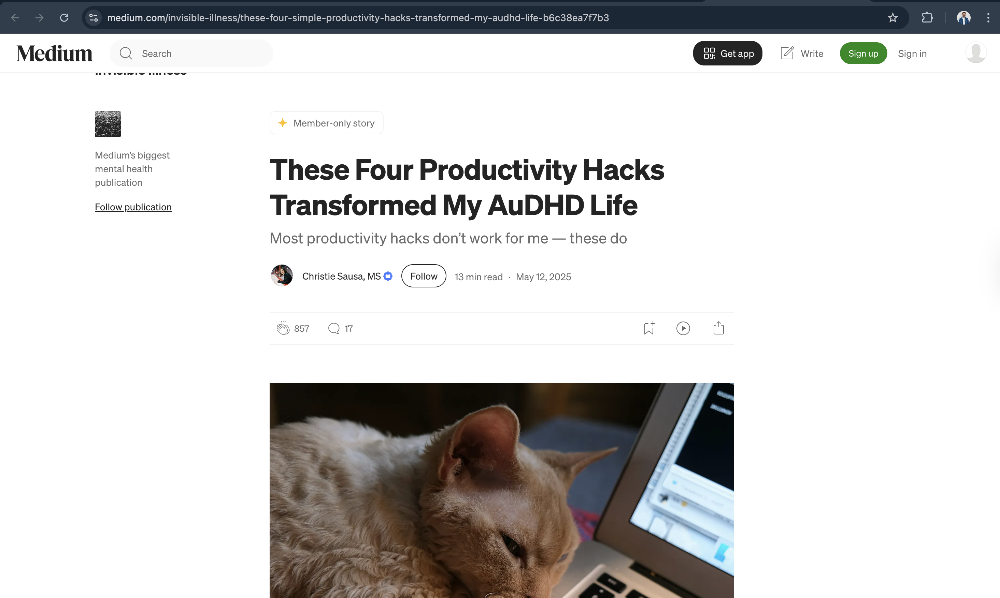

# Working with Vulnerable Populations

## Research & Learn

### Who are considered vulnerable populations, and what challenges might they face in digital spaces?

Vulnerable populations include people who may need extra support, such as individuals with ADHD, Autism, disabilities, or mental health challenges. In digital spaces, they may find it difficult to use tools that are complicated, confusing, or full of distractions.

### What ethical considerations are important when designing or working with neurodivergent individuals? (Hint: Avoid overwhelming UX, respect sensory needs, ensure clear communication.)

It is important to design tools that are simple, clear, and easy to use. We should avoid overwhelming users with too much information and respect their needs and differences.

### How can you make interactions and content more accessible for people with ADHD or Autism? (e.g., simple language, predictable navigation, reducing cognitive load)

I can make things easier by using simple language, clear instructions, and a clean layout. Breaking tasks into smaller steps and reducing distractions can also help.

### How can we support neurodivergent team members in a professional setting? (Hint: Be clear in communication, respect different working styles, and allow flexibility.)

I can support them by communicating clearly, being patient, and respecting different ways of working. It is also helpful to give clear instructions and allow flexibility when needed.

## Reflection

### How can you adjust your communication style to be more inclusive of neurodivergent users and teammates?

I can use clear and simple language, avoid long or confusing explanations, and make sure my messages are easy to understand.

### What are some common UX or communication pitfalls that might make Focus Bear less accessible or supportive?

Some problems include complicated designs, too many notifications, unclear instructions, or too much information on one screen.

### What is one practical change you can make in your work to better support vulnerable populations?

One practical change I can make is writing instructions in a simple and clear way so users can easily understand what they need to do.

## Task

### Read a first-person account from someone with ADHD or Autism about their experiences with productivity tools. (Hint: Look for blog posts, videos, or community discussions.)

I read a first-person article titled
“These Four Productivity Hacks Transformed My AuDHD Life” by Christie Sausa (Medium)

Link: https://medium.com/invisible-illness/these-four-simple-productivity-hacks-transformed-my-audhd-life-b6c38ea7f7b3

In this article, the author shares her personal experience of living with ADHD and Autism (AuDHD) and how she struggled with traditional productivity tools. She explains that even though she wanted to stay productive, many systems felt overwhelming, difficult to follow, and mentally exhausting.

One line that stood out to me was:

“It all felt like too much.”

This clearly shows how productivity tools can unintentionally create pressure instead of helping users.

What stood out to me

What stood out to me personally is how hard the author was trying to stay productive, but still felt overwhelmed by the tools that were supposed to help her. It made me realize that the problem is not always the user — sometimes the design of the system does not match how people think or work.

This changed my perspective because I understood that productivity tools should focus more on reducing stress and supporting users, rather than pushing them to do more. For a product like Focus Bear, it is important that users feel guided and supported, not pressured.

### Identify one design or communication improvement that could make Focus Bear more accessible.

Breaking large tasks into smaller, manageable steps.

Many users with ADHD or executive functioning challenges struggle with starting tasks when they feel too big or unclear. By guiding users step-by-step instead of showing everything at once, Focus Bear can reduce overwhelm and make it easier for users to take action.

This approach makes the experience feel more supportive and achievable.

### Practice writing a clear, patient, and supportive response to a hypothetical user struggling with executive functioning.

Thank you for sharing how you’re feeling — it sounds like things have been a bit overwhelming, and that’s completely understandable.

You don’t need to do everything at once. A good starting point could be choosing just one small task, even something simple. Once you begin, it often becomes easier to continue.

You could also try a short focus session and take a break afterward. It’s okay to go at your own pace — progress doesn’t have to be perfect.

You’re doing your best, and that matters. If you need any support, we’re here to help.

## proof

