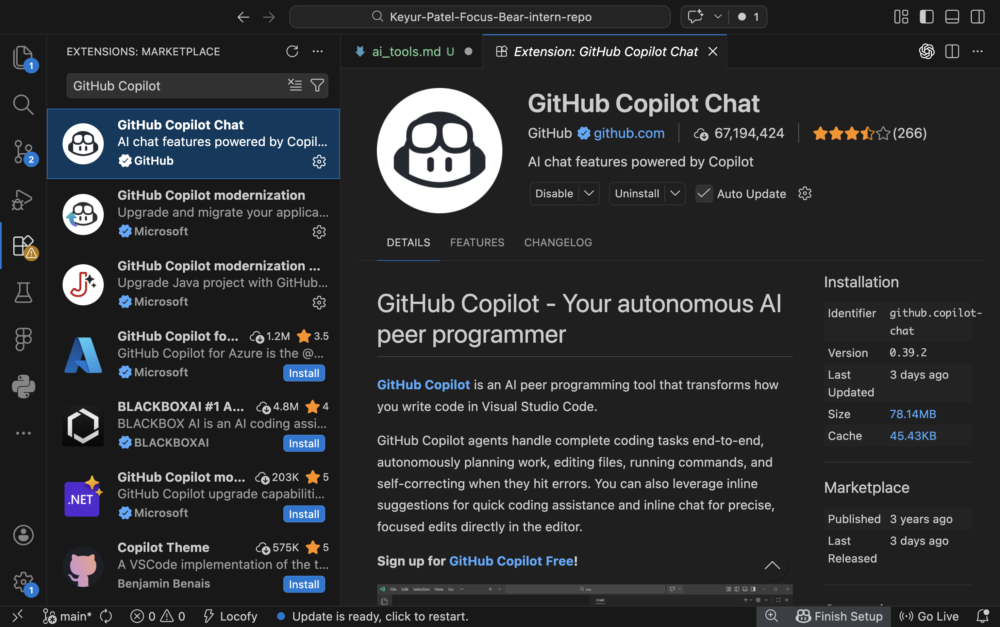
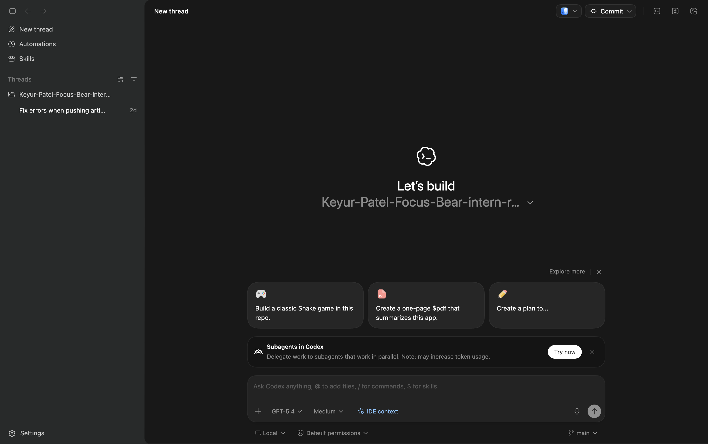
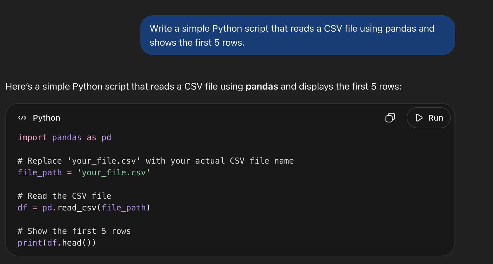
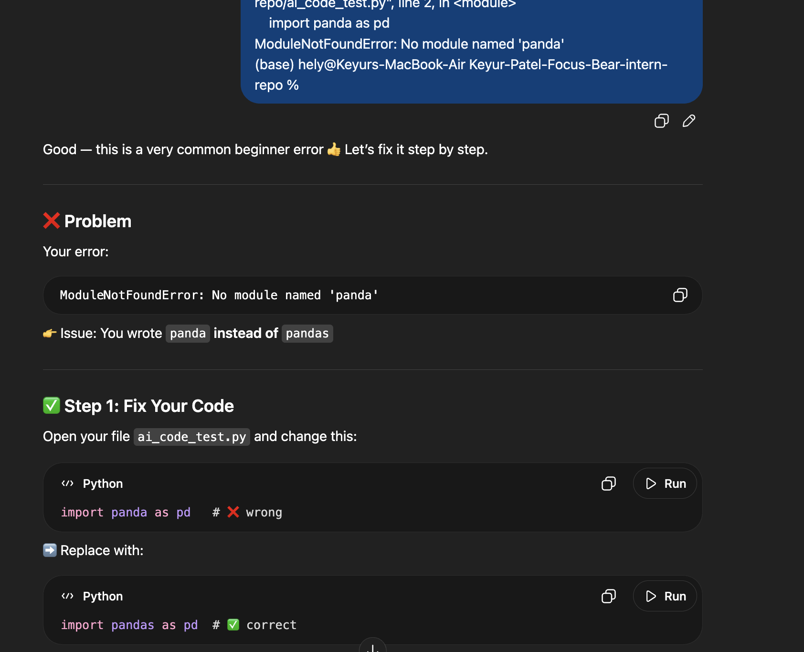
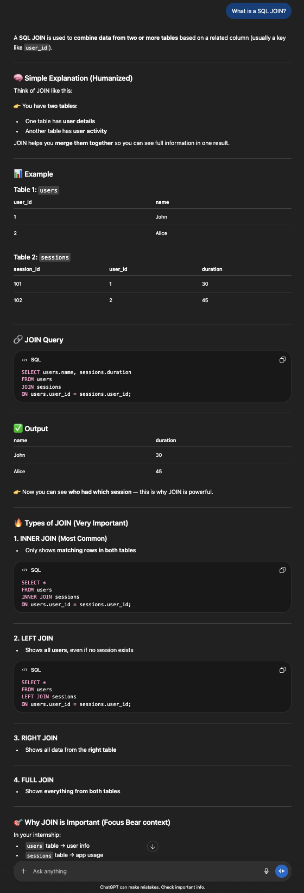

## Tasks

### Research and install an AI coding assistant (choose one or more):

#### What are AI coding assistants?

AI coding assistants are tools that help you:

write code faster
fix errors
understand concepts
generate ideas

They act like a smart coding partner.

1. GitHub Copilot
   Works inside VS Code
   Suggests code while typing
   Great for productivity

2. ChatGPT
   Helps with debugging, explanation, logic
   Best for learning + problem solving

3. Claude AI
   Similar to ChatGPT
   Strong at explaining code and reasoning

### GitHub Copilot (VS Code extension for code suggestions).

### ChatGPT (for coding questions and debugging).

### Claude AI (alternative AI assistant for code help).

## Experiment with using AI for development:

### Generate code snippets and analyze how useful they are.

### Use AI for debugging a simple problem.

### Ask AI for explanations on a new concept you're learning.

## Document your experience in ai_tools.md:

### Which AI tools did you try?

I tried using ChatGPT and GitHub Copilot. ChatGPT helped me understand concepts, debug errors, and generate code by asking questions. GitHub Copilot was useful inside VS Code because it suggested code automatically while I was typing, which made coding faster.

### What worked well? What didn’t?

AI tools worked really well for generating code quickly and helping me fix errors. For example, when I had a bug, ChatGPT explained the issue clearly and gave a solution that I could apply immediately. Copilot also saved time by suggesting complete lines of code.

However, sometimes the suggestions were not fully correct or needed changes. I noticed that I still had to understand the code and review it carefully instead of just copying and pasting.

### When do you think AI is most useful for coding?

I think AI is most useful when I am stuck, debugging errors, or learning something new. It is also helpful for generating basic code or getting a starting point for a task. AI makes development faster and reduces frustration.

But for complex logic or important tasks, I think it is still important to rely on my own understanding and not depend completely on AI.
