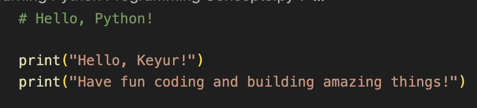
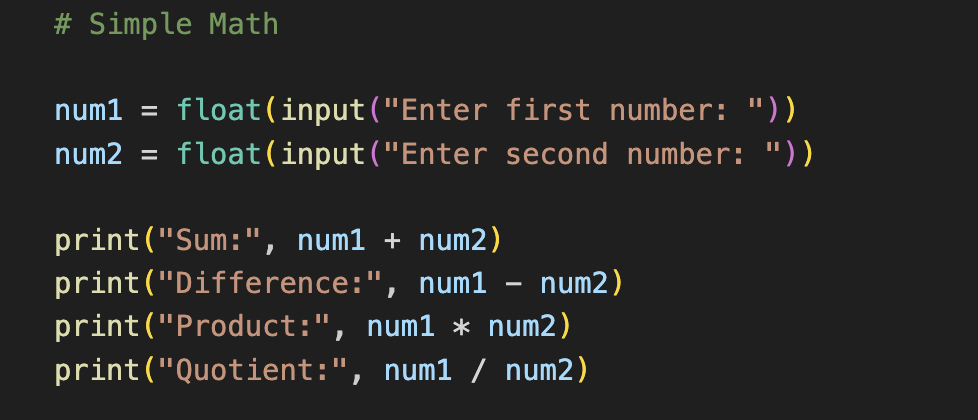
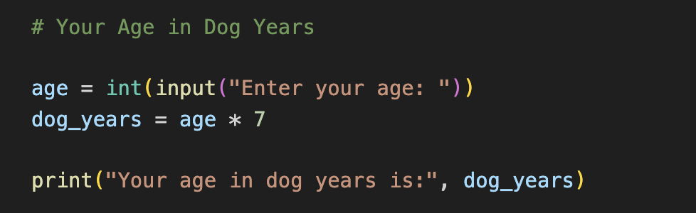
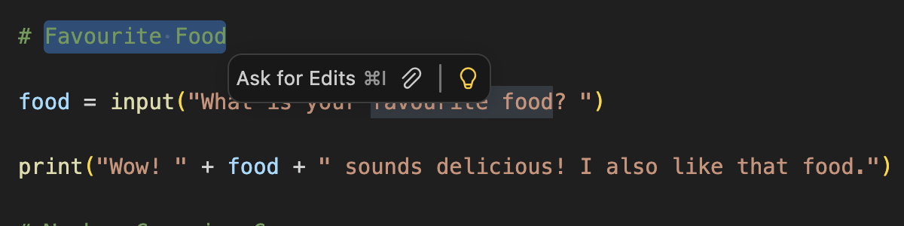
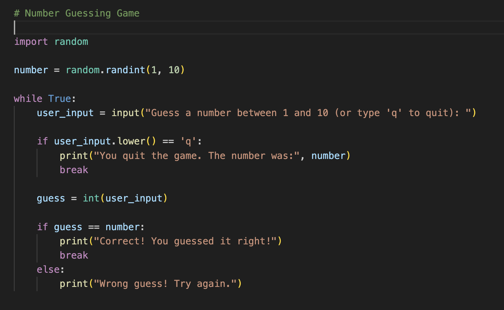
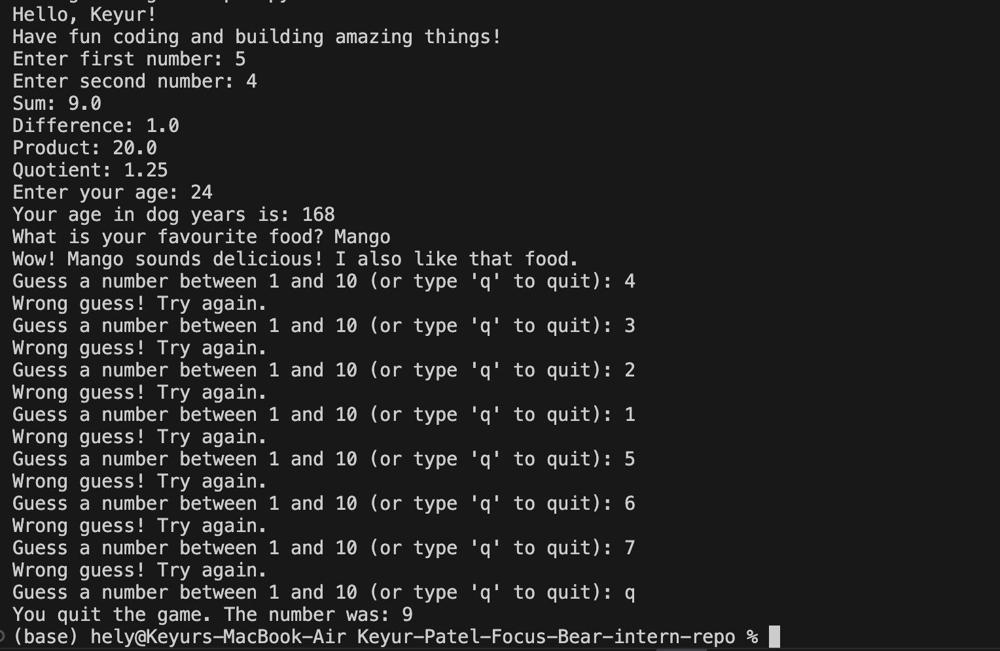

# Learning Python Programming Concepts

## Tasks

### Hello, Python!

### Simple Math

### Your Age in Dog Years

### Favourite Food

### Number Guessing Game

### Output of the above tasks

## Reflection

### Which task did you find the most fun?

I found the number guessing game the most fun because it felt interactive and exciting to play with random numbers.

### How did you feel when you saw your code running correctly for the first time?

I felt really happy and proud. It was exciting to see my code working exactly as expected, which motivated me to learn more.

### How could you imagine using these skills to solve problems or make daily tasks easier?

These skills can help automate simple tasks like calculations, reminders, or small tools, making everyday work faster and more efficient.
