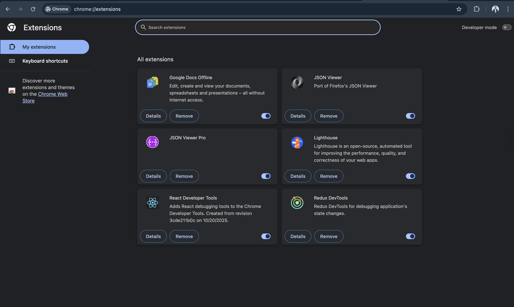

# Set Up Dev Productivity Chrome Extensions

### Which extensions did you install? Why?

I installed React Developer Tools, Redux DevTools, JSON Viewer, and Lighthouse. These extensions help inspect React components, debug application state, format JSON data from APIs, and analyze website performance. They make development and debugging much easier.

### What was the most useful thing you learned?

The most useful thing I learned is that the browser can be a powerful development tool. Extensions like Lighthouse and JSON Viewer make it much easier to analyze website performance and understand API responses.

## Proof

