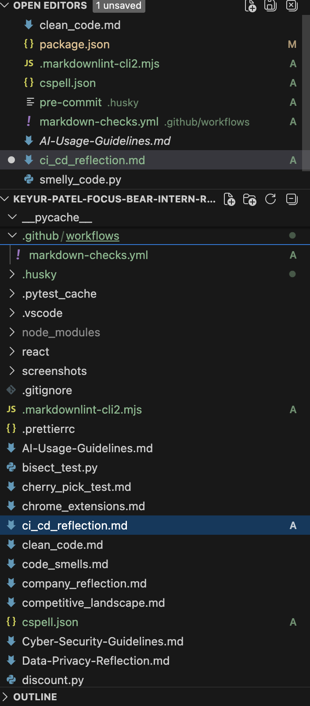
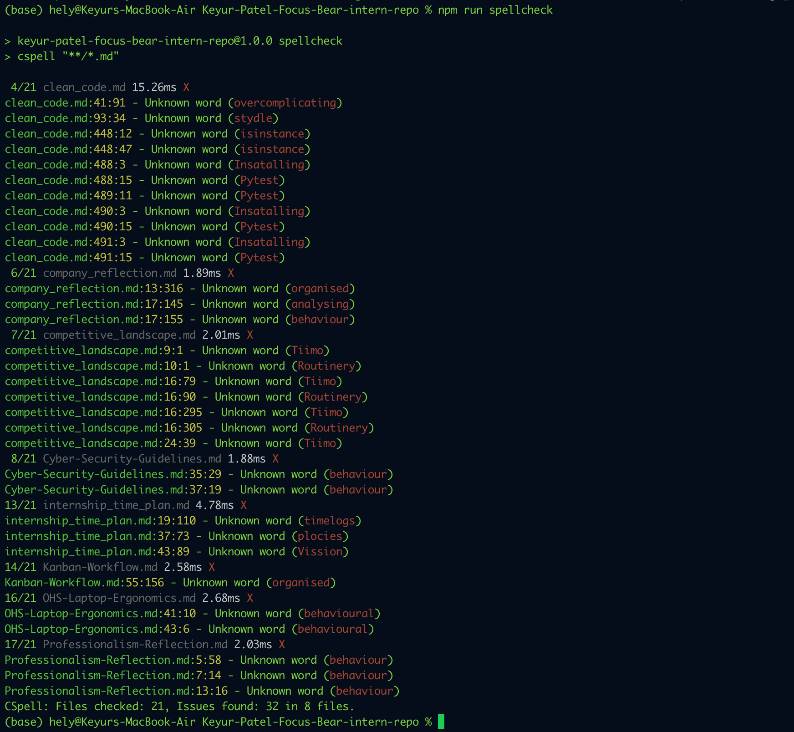

# Static Analysis Checks in CI/CD

## What is the purpose of CI/CD?

CI/CD helps teams automate important parts of software development so that changes can be checked and delivered more reliably. Continuous Integration focuses on automatically testing and validating changes whenever developers push code or open pull requests. This helps catch problems early before they are merged into the main branch.

Continuous Delivery or Continuous Deployment builds on that idea by helping teams prepare or release software in a more consistent and automated way. Overall, CI/CD improves confidence, reduces manual work, and supports faster and safer development.

## How does automating style checks improve project quality?

Automating style checks improves project quality by making sure common issues are caught early and consistently. In this task, Markdown linting and spell checks helped identify formatting mistakes and spelling issues before the changes were merged. This keeps documentation cleaner, easier to read, and more professional.

It also reduces the chance that small problems will be ignored or forgotten. Instead of relying on someone to manually review every detail, the automated checks apply the same standard every time.

## What are some challenges with enforcing checks in CI/CD?

One challenge is that strict rules can sometimes feel frustrating, especially when they block commits or pull requests for small issues. Another challenge is that some tools may flag words, names, or formatting choices that are actually acceptable in the project, which means the configuration needs to be adjusted carefully.

There is also a learning curve when setting up CI/CD for the first time. Developers need to understand workflow files, dependencies, and how to troubleshoot failed checks. If the configuration is too strict or unclear, it can slow people down instead of helping them.

## How do CI/CD pipelines differ between small projects and large teams?

In small projects, CI/CD pipelines are usually simpler and focus on basic checks such as linting, spell checking, and a few tests. The goal is mainly to keep the project consistent and avoid obvious mistakes.

In larger teams, CI/CD pipelines are usually much more advanced. They may include multiple test stages, security scanning, code coverage checks, deployment steps, approval rules, and environment-based releases. Large teams often need stronger automation because more people are contributing at the same time, and the risk of integration problems is higher.

## proof

#### CI/CD workflow added for markdown linting and spell checking.

#### Thank you
