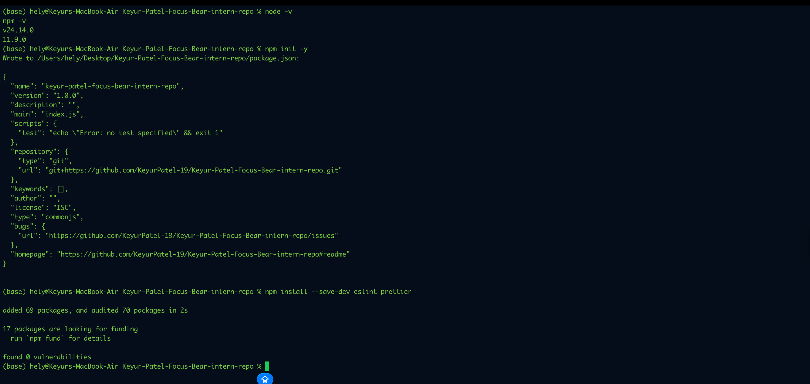
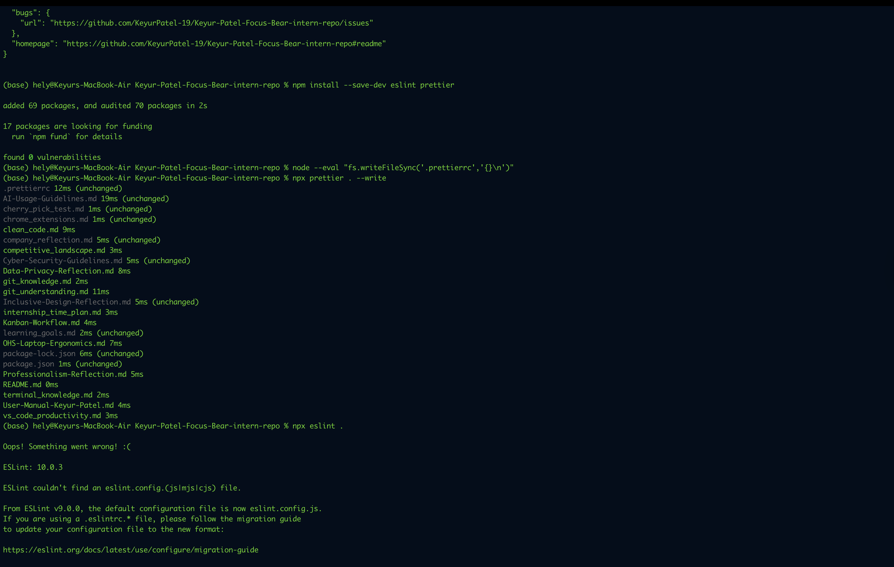

# Understanding Clean Code Principles

## What is clean code?

Clean code is code that is easy to read, easy to understand, and easy to change. It is not just about making the code work. It is also about making sure the next person who reads it, or even my future self, can understand it without getting confused. In real projects, clean code matters because developers often work in teams, and messy code can waste a lot of time.

## 1. Simplicity

Simplicity means keeping code as simple as possible. A simple solution is usually better than a complicated one if both solve the problem correctly. When code is simple, it is easier to understand, test, and fix later. Overcomplicated code may look clever, but it often creates confusion and unnecessary bugs.

### Why it matters

Simple code saves time. It helps developers quickly understand what the program is doing without needing to decode complex logic.

## 2. Readability

Readability means writing code in a way that is easy for humans to read. This includes using meaningful variable names, proper indentation, and clear structure. Code is read far more often than it is written, so readability is extremely important.

### Why it matters

Readable code makes collaboration much easier. If another developer opens the file, they should be able to understand the logic without needing a long explanation.

## 3. Maintainability

Maintainability means the code can be updated, fixed, or improved without too much difficulty. Good maintainable code is organized, separated into logical parts, and avoids unnecessary duplication.

### Why it matters

In real-world development, code is rarely written once and left alone. Features change, bugs appear, and improvements are needed. Maintainable code makes these future changes much easier.

## 4. Consistency

Consistency means following the same style, naming rules, formatting, and project conventions throughout the codebase. For example, if one part of the project uses camelCase, the rest should follow the same pattern where appropriate.

### Why it matters

Consistent code looks more professional and is much easier to navigate. It helps the whole team work in the same way and reduces confusion.

## 5. Efficiency

Efficiency means writing code that performs well and uses resources properly, but without overcomplicating the solution too early. Clean code does not mean chasing tiny performance improvements everywhere. It means balancing clarity and performance in a sensible way.

### Why it matters

Efficient code helps applications run better, but code should not become difficult to understand just for a small performance gain. First make it correct and clean, then improve performance where it actually matters.

## Find an example of messy code online (or write one yourself) and describe why it's difficult to read.

### Example of Messy code

a=[1,2,3,4,5]
s=0
for i in a:
if i%2==0:
s=s+i
print(s)

### Why this code is difficult to read

This code works, but it is not very clean. The variable names like a and s are too short and do not clearly explain their purpose. Someone reading it has to guess that a is a list of numbers and s is the sum of even values. The logic is also placed directly in one block, so it is not very reusable. If this needed to be used again in another part of the program, the code would likely need to be copied.

## Rewrite the code in a cleaner, more structured way.

numbers = [1, 2, 3, 4, 5]
even_sum = 0

for number in numbers:
if number % 2 == 0:
even_sum += number

print(even_sum)

---

# Code Formatting & Style Guides

### Why is code formatting important?

Code formatting is important because it keeps the code clean, consistent, and easy to understand. When all files follow the same style, it becomes much easier to read the code, find mistakes, and work with other developers. Good formatting also makes the project look more professional. ESLint is designed to identify and report patterns in JavaScript code to improve consistency and avoid bugs, while Prettier automatically reformats code into a consistent style.

### What issues did the linter detect?

The linter usually detects problems like missing semicolons, unused variables, wrong spacing, inconsistent quotes, or code that does not follow the configured style rules. Depending on the file, it can also warn about possible mistakes that may cause bugs later. ESLint works through project configuration files and rules, so the exact warnings depend on how the project is set up.

### Did formatting the code make it easier to read?

Yes, formatting the code made it much easier to read. After running Prettier and fixing ESLint warnings, the code looked more organized and consistent. It was easier to follow the structure, understand logic, and spot errors quickly. Prettier is specifically built to reprint code into a consistent style, including line wrapping when needed.

### shall note on the Airbnb JavaScript Style Guide

The Airbnb JavaScript Style Guide is a widely used guide that gives practical rules for writing clean and consistent JavaScript. It describes itself as “a mostly reasonable approach to JavaScript,” and it is commonly used as a reference for naming, spacing, functions, objects, imports, and general coding style.

## Proof for code formatting and stydle guides

### Installing ESLint and Prettier

### Running Prettier and ESLint

---

# Naming Variables & Functions

### Find examples of unclear variable names in an existing codebase (or write your own).

### Example of Unclear Variable and Function Names

def calc(x, y):
z = x \* y
return z

a = 5
b = 10
c = calc(a, b)
print(c)

### why it is unclear:

This code works, but the naming is not clear. The function name `calc` is too vague because it does not explain what kind of calculation is being done. The variables `x`, `y`, `z`, `a`, `b`, and `c` also do not give any meaning. Someone reading this code would need to inspect the logic to understand that it is multiplying two numbers.

### Refactor the code by renaming variables/functions for better clarity.

### Refactored Version with Better Names

def multiply_numbers(first_number, second_number):
product = first_number \* second_number
return product

number_one = 5
number_two = 10
result = multiply_numbers(number_one, number_two)
print(result)

### Explain the improvement:

This version is much easier to understand. The function name `multiply_numbers` clearly explains what the function does. The variable names `first_number`, `second_number`, `product`, and `result` all make the code more readable. Even without looking deeply at the logic, the purpose of the code is obvious.

### What makes a good variable or function name?

A good variable or function name should clearly explain its purpose. When someone reads the code, they should be able to understand what the variable stores or what the function does without needing extra explanation. Good names are meaningful, specific, and easy to read. They make the code feel more natural and reduce confusion for anyone working on it later. A well-named function usually describes an action, while a well-named variable describes the data it holds.

### What issues can arise from poorly named variables?

Poorly named variables can make the code confusing and harder to follow. When names are too short, too vague, or unrelated to their actual purpose, it becomes difficult to understand what the code is doing. This can lead to mistakes when updating or debugging the code. It also slows down teamwork because other developers may need extra time to figure out the logic. In the long run, poor naming can make even simple code feel messy and frustrating to maintain.

### How did refactoring improve code readability?

Refactoring improved the readability of the code by replacing unclear names with more meaningful ones. After the changes, the purpose of each variable and function became much easier to understand. The code now explains itself more naturally, so a reader does not have to spend extra time guessing what each part means. This makes the code cleaner, more organized, and easier to maintain in the future.
