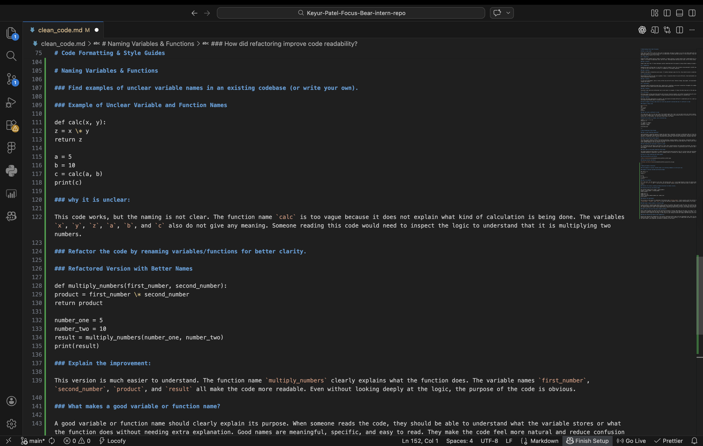
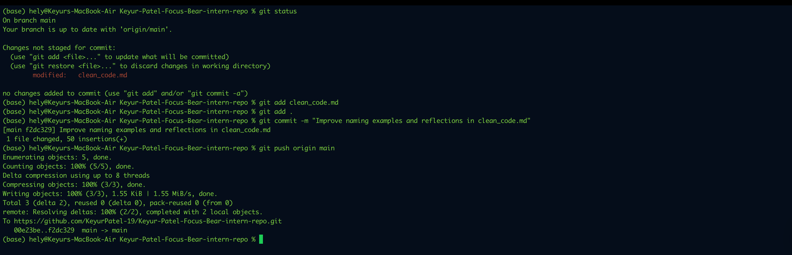
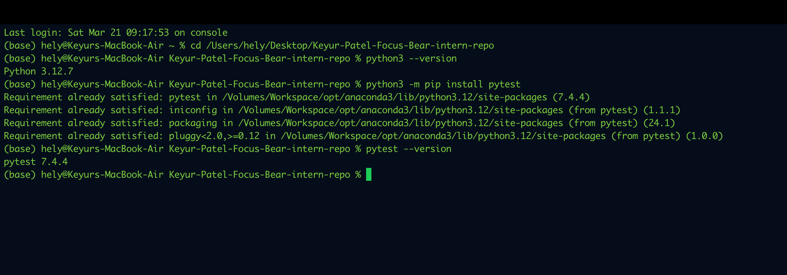
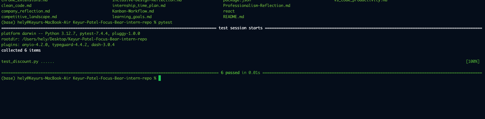
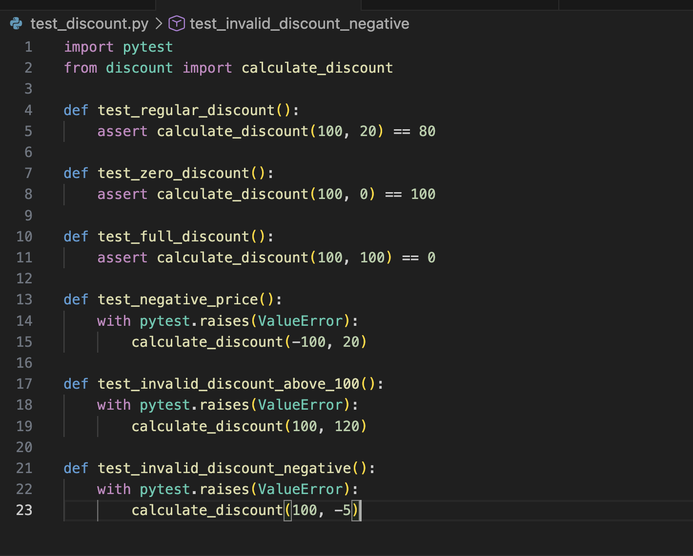
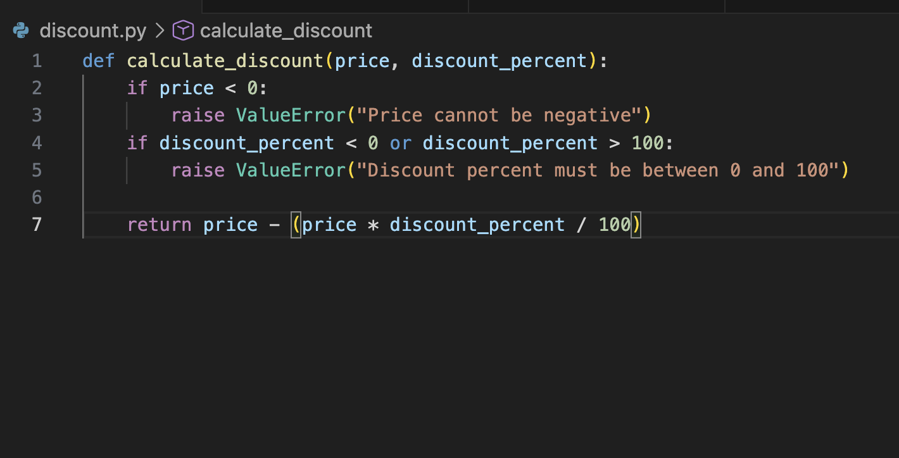
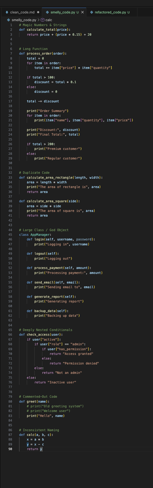
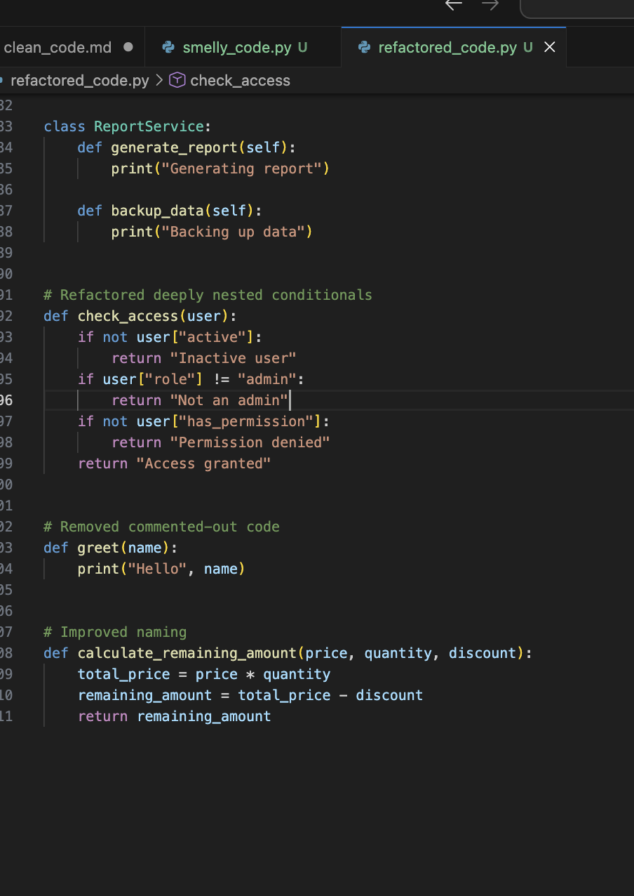

# Understanding Clean Code Principles

## What is clean code?

Clean code is code that is easy to read, easy to understand, and easy to change. It is not just about making the code work. It is also about making sure the next person who reads it, or even my future self, can understand it without getting confused. In real projects, clean code matters because developers often work in teams, and messy code can waste a lot of time.

## 1. Simplicity

Simplicity means keeping code as simple as possible. A simple solution is usually better than a complicated one if both solve the problem correctly. When code is simple, it is easier to understand, test, and fix later. Overcomplicated code may look clever, but it often creates confusion and unnecessary bugs.

### Why it matters

Simple code saves time. It helps developers quickly understand what the program is doing without needing to decode complex logic.

## 2. Readability

Readability means writing code in a way that is easy for humans to read. This includes using meaningful variable names, proper indentation, and clear structure. Code is read far more often than it is written, so readability is extremely important.

### Why it matters

Readable code makes collaboration much easier. If another developer opens the file, they should be able to understand the logic without needing a long explanation.

## 3. Maintainability

Maintainability means the code can be updated, fixed, or improved without too much difficulty. Good maintainable code is organized, separated into logical parts, and avoids unnecessary duplication.

### Why it matters

In real-world development, code is rarely written once and left alone. Features change, bugs appear, and improvements are needed. Maintainable code makes these future changes much easier.

## 4. Consistency

Consistency means following the same style, naming rules, formatting, and project conventions throughout the codebase. For example, if one part of the project uses camelCase, the rest should follow the same pattern where appropriate.

### Why it matters

Consistent code looks more professional and is much easier to navigate. It helps the whole team work in the same way and reduces confusion.

## 5. Efficiency

Efficiency means writing code that performs well and uses resources properly, but without overcomplicating the solution too early. Clean code does not mean chasing tiny performance improvements everywhere. It means balancing clarity and performance in a sensible way.

### Why it matters

Efficient code helps applications run better, but code should not become difficult to understand just for a small performance gain. First make it correct and clean, then improve performance where it actually matters.

## Find an example of messy code online (or write one yourself) and describe why it's difficult to read.

### Example of Messy code

a=[1,2,3,4,5]
s=0
for i in a:
if i%2==0:
s=s+i
print(s)

### Why this code is difficult to read

This code works, but it is not very clean. The variable names like a and s are too short and do not clearly explain their purpose. Someone reading it has to guess that a is a list of numbers and s is the sum of even values. The logic is also placed directly in one block, so it is not very reusable. If this needed to be used again in another part of the program, the code would likely need to be copied.

## Rewrite the code in a cleaner, more structured way.

numbers = [1, 2, 3, 4, 5]
even_sum = 0

for number in numbers:
if number % 2 == 0:
even_sum += number

print(even_sum)

---

# Code Formatting & Style Guides

### Why is code formatting important?

Code formatting is important because it keeps the code clean, consistent, and easy to understand. When all files follow the same style, it becomes much easier to read the code, find mistakes, and work with other developers. Good formatting also makes the project look more professional. ESLint is designed to identify and report patterns in JavaScript code to improve consistency and avoid bugs, while Prettier automatically reformats code into a consistent style.

### What issues did the linter detect?

The linter usually detects problems like missing semicolons, unused variables, wrong spacing, inconsistent quotes, or code that does not follow the configured style rules. Depending on the file, it can also warn about possible mistakes that may cause bugs later. ESLint works through project configuration files and rules, so the exact warnings depend on how the project is set up.

### Did formatting the code make it easier to read?

Yes, formatting the code made it much easier to read. After running Prettier and fixing ESLint warnings, the code looked more organized and consistent. It was easier to follow the structure, understand logic, and spot errors quickly. Prettier is specifically built to reprint code into a consistent style, including line wrapping when needed.

### shall note on the Airbnb JavaScript Style Guide

The Airbnb JavaScript Style Guide is a widely used guide that gives practical rules for writing clean and consistent JavaScript. It describes itself as “a mostly reasonable approach to JavaScript,” and it is commonly used as a reference for naming, spacing, functions, objects, imports, and general coding style.

## Proof for code formatting and stydle guides

### Installing ESLint and Prettier

### Running Prettier and ESLint

---

# Naming Variables & Functions

### Find examples of unclear variable names in an existing codebase (or write your own).

### Example of Unclear Variable and Function Names

def calc(x, y):
z = x \* y
return z

a = 5
b = 10
c = calc(a, b)
print(c)

### why it is unclear:

This code works, but the naming is not clear. The function name `calc` is too vague because it does not explain what kind of calculation is being done. The variables `x`, `y`, `z`, `a`, `b`, and `c` also do not give any meaning. Someone reading this code would need to inspect the logic to understand that it is multiplying two numbers.

### Refactor the code by renaming variables/functions for better clarity.

### Refactored Version with Better Names

def multiply_numbers(first_number, second_number):
product = first_number \* second_number
return product

number_one = 5
number_two = 10
result = multiply_numbers(number_one, number_two)
print(result)

### Explain the improvement:

This version is much easier to understand. The function name `multiply_numbers` clearly explains what the function does. The variable names `first_number`, `second_number`, `product`, and `result` all make the code more readable. Even without looking deeply at the logic, the purpose of the code is obvious.

### What makes a good variable or function name?

A good variable or function name should clearly explain its purpose. When someone reads the code, they should be able to understand what the variable stores or what the function does without needing extra explanation. Good names are meaningful, specific, and easy to read. They make the code feel more natural and reduce confusion for anyone working on it later. A well-named function usually describes an action, while a well-named variable describes the data it holds.

### What issues can arise from poorly named variables?

Poorly named variables can make the code confusing and harder to follow. When names are too short, too vague, or unrelated to their actual purpose, it becomes difficult to understand what the code is doing. This can lead to mistakes when updating or debugging the code. It also slows down teamwork because other developers may need extra time to figure out the logic. In the long run, poor naming can make even simple code feel messy and frustrating to maintain.

### How did refactoring improve code readability?

Refactoring improved the readability of the code by replacing unclear names with more meaningful ones. After the changes, the purpose of each variable and function became much easier to understand. The code now explains itself more naturally, so a reader does not have to spend extra time guessing what each part means. This makes the code cleaner, more organized, and easier to maintain in the future.

### Proof for Naming Variables & Functions

### Notes and Refactoring Screenshot

### Git Commit Screenshot

---

# Writing Small, Focused Functions

### Find an example of a long, complex function in an existing codebase (or write your own).

## Example of a Long, Complex Function

### Before Refactoring

def process_order(order):
if not order.get("items"):
return "Order has no items"

    subtotal = 0
    for item in order["items"]:
        subtotal += item["price"] * item["quantity"]

    discount = 0
    if subtotal > 100:
        discount = subtotal * 0.1

    tax = (subtotal - discount) * 0.1
    total = subtotal - discount + tax

    summary = "Order Summary\n"
    summary += "Customer: " + order["customer"] + "\n"
    summary += "Items:\n"

    for item in order["items"]:
        summary += f"- {item['name']} x{item['quantity']} = ${item['price'] * item['quantity']}\n"

    summary += f"Subtotal: ${subtotal}\n"
    summary += f"Discount: ${discount}\n"
    summary += f"Tax: ${tax}\n"
    summary += f"Total: ${total}\n"

    return summary

This function is difficult to maintain because it handles too many responsibilities at once. It validates the order, calculates the subtotal, applies a discount, calculates tax, and formats the final output all in one place.
Refactor it into multiple smaller functions with clear responsibilities.

### Write reflections in clean_code.md:

def validate_order(order):
return bool(order.get("items"))

def calculate_subtotal(items):
return sum(item["price"] \* item["quantity"] for item in items)

def calculate_discount(subtotal):
return subtotal \* 0.1 if subtotal > 100 else 0

def calculate_tax(subtotal, discount):
return (subtotal - discount) \* 0.1

def format_items(items):
lines = []
for item in items:
line = f"- {item['name']} x{item['quantity']} = ${item['price'] \* item['quantity']}"
lines.append(line)
return "\n".join(lines)

def build_order_summary(order, subtotal, discount, tax, total):
return (
f"Order Summary\n"
f"Customer: {order['customer']}\n"
f"Items:\n{format_items(order['items'])}\n"
f"Subtotal: ${subtotal}\n"
f"Discount: ${discount}\n"
f"Tax: ${tax}\n"
f"Total: ${total}\n"
)

def process_order(order):
if not validate_order(order):
return "Order has no items"

    subtotal = calculate_subtotal(order["items"])
    discount = calculate_discount(subtotal)
    tax = calculate_tax(subtotal, discount)
    total = subtotal - discount + tax

    return build_order_summary(order, subtotal, discount, tax, total)

### Why is breaking down functions beneficial?

Breaking down functions is beneficial because it makes the code easier to understand and easier to maintain. When one function tries to do everything, it becomes harder to read and more difficult to debug. Smaller functions make the logic clearer because each function has one specific responsibility. This also improves reusability, since helper functions can be used again in other parts of the program. In addition, testing becomes easier because each part of the logic can be checked separately.

### How did refactoring improve the structure of the code?

Refactoring improved the structure by separating the different responsibilities into smaller, clearly named functions. The original version mixed validation, calculation, and formatting in one block, which made it feel crowded and harder to follow. After refactoring, the main function became much cleaner and easier to read because the detailed logic was moved into helper functions. This made the code more organized, more modular, and much easier to update in the future without affecting the whole function.

---

# Avoiding Code Duplication

## Research on the DRY Principle

The DRY principle stands for “Don’t Repeat Yourself.” It means that the same logic should not be written again and again in different places. When code is duplicated, even small updates become risky because every copy needs to be changed correctly. If one version is updated and another is forgotten, bugs and inconsistencies can appear.

Applying the DRY principle helps make code cleaner, easier to maintain, and easier to understand. Instead of repeating the same block of code, it is better to move that logic into a single reusable function.

### Find a section of code in your test repo with unnecessary repetition.

### Before Refactoring

def send_welcome_email(name, email):
message = f"Hello {name}, welcome to our platform!"
print("Sending email to:", email)
print("Message:", message)
print("Email sent successfully.")

def send_password_reset_email(name, email):
message = f"Hello {name}, here is your password reset link."
print("Sending email to:", email)
print("Message:", message)
print("Email sent successfully.")

def send_subscription_email(name, email):
message = f"Hello {name}, your subscription has been activated."
print("Sending email to:", email)
print("Message:", message)
print("Email sent successfully.")

In this example, the email sending logic is repeated in multiple functions. Only the message content changes, while the printing and delivery steps remain the same.

### Refactor the code to eliminate duplication.

def send_email(email, message):
print("Sending email to:", email)
print("Message:", message)
print("Email sent successfully.")

def send_welcome_email(name, email):
message = f"Hello {name}, welcome to our platform!"
send_email(email, message)

def send_password_reset_email(name, email):
message = f"Hello {name}, here is your password reset link."
send_email(email, message)

def send_subscription_email(name, email):
message = f"Hello {name}, your subscription has been activated."
send_email(email, message)

After refactoring, the repeated email sending logic is placed inside one reusable function. This removes duplication and makes the code much easier to update in the future.

## Write reflections in clean_code.md:

### What were the issues with duplicated code?

The main issue with duplicated code was that the same logic appeared in multiple places. This makes maintenance harder because even a small change must be repeated everywhere. It also increases the risk of inconsistency, since one section might get updated while another is forgotten. In larger projects, this can lead to bugs, wasted time, and more confusing code.

### How did refactoring improve maintainability?

Refactoring improved maintainability by moving the repeated logic into a single reusable function. This made the code shorter, cleaner, and easier to understand. It also means that future changes only need to be made in one place instead of several. As a result, the code became more reliable and easier to manage.

---

# Refactoring Code for Simplicity

### Research on Refactoring Techniques

Refactoring is the process of improving the structure and readability of existing code without changing its behavior. The main goal of refactoring is to make the code easier to understand, maintain, and modify in the future.

Some common refactoring techniques include:
Extract Method – Breaking a large block of code into smaller functions with clear purposes.
Remove Unnecessary Conditions – Simplifying complex conditional statements.
Rename Variables or Functions – Using meaningful names that clearly describe their purpose.
Eliminate Duplicate Code – Moving repeated logic into reusable functions.
Simplify Logic – Replacing overly complicated structures with clearer and shorter code.

### Find an example of overly complicated code in an existing project (or write your own).

def calculate_average(numbers):
total = 0
count = 0

    for i in range(0, len(numbers)):
        total = total + numbers[i]
        count = count + 1

    if count != 0:
        average = total / count
    else:
        average = 0

    return average

This code works correctly, but it is more complicated than necessary. It manually counts elements and performs extra steps that Python can already handle more efficiently.

### Refactor it to make it simpler and more readable.

def calculate_average(numbers):
if not numbers:
return 0
return sum(numbers) / len(numbers)

The refactored version is shorter, clearer, and easier to understand. It uses Python's built-in functions to perform the same task with much less code.

### What made the original code complex?

The original code was complex because it included unnecessary variables and extra steps to perform a simple task. It manually counted the elements in the list and used a loop to calculate the total, which made the function longer than needed. Although the code worked, it was harder to read and understand at first glance.

### How did refactoring improve it?

Refactoring improved the code by simplifying the logic and removing unnecessary steps. By using built-in functions like sum() and len(), the function became shorter and easier to understand. The final version clearly shows what the function is doing, which makes it easier to maintain and modify in the future.

---

# Commenting & Documentation

## Research best practices for writing comments and documentation.

Best Practices for Writing Comments and Documentation
-Write comments only when they add useful context.
-Use comments to explain why something is being done, not just what the code is doing.
-Keep comments short, clear, and easy to understand.
-Update comments when code changes, so they do not become misleading.
-Avoid obvious comments that repeat the code.
-Prefer clear variable names, function names, and simple logic before adding comments.
-Use documentation for functions, files, or modules when someone may need help understanding how to use them.

## Find an example of poorly commented code and rewrite the comments to be more useful.

### set x to 5

x = 5

### loop through numbers

for i in range(x): # print i
print(i)

Why this is poor:

These comments are not very helpful because they only repeat what the code is already saying. Anyone reading the code can already see that x is set to 5 and that the loop prints numbers.

### Improved version

#### Print the first five counting numbers starting from 0.

total_numbers = 5

for number in range(total_numbers):
print(number)
Why this is better

This version is better because:
The variable name total_numbers is clearer than x.
The loop variable number is clearer than i.
The comment gives a little useful context instead of repeating each line.

### When should you add comments?

Comments should be added when the code needs extra explanation that is not obvious just by reading it. They are helpful when explaining the purpose of a block of code, a business rule, a workaround, or why a certain decision was made. Good comments give useful context that helps another developer understand the reason behind the code.

### When should you avoid comments and instead improve the code?

Comments should be avoided when they only repeat what the code already says. In those cases, it is usually better to improve the code by using clearer variable names, smaller functions, and simpler logic. Clean and readable code reduces the need for unnecessary comments and makes the program easier to understand.

---

# Handling Errors & Edge Cases

### Find an existing function that doesn’t properly handle errors or invalid inputs.

def divide_numbers(a, b):
return a / b

Why this is bad:

This function works only when both inputs are valid and b is not zero.
It does not handle:
division by zero
text input
missing input

#### Refactored version with better error handling

def divide_numbers(a, b):
if a is None or b is None:
return "Error: both values are required."

    if not isinstance(a, (int, float)) or not isinstance(b, (int, float)):
        return "Error: inputs must be numbers."

    if b == 0:
        return "Error: cannot divide by zero."

    return a / b

### What was the issue with the original code?

The original function assumed that the input would always be correct, which made it fragile. It did not check whether the values were missing, the correct type, or safe to use in the calculation. Because of that, even a small mistake like dividing by zero or passing text instead of a number could cause the program to fail unexpectedly.

### How does handling errors improve reliability?

Handling errors improves reliability because it helps the program respond safely when something goes wrong. Instead of crashing or producing confusing results, the code can catch the problem early and give a clear message. This makes the software more stable, easier to debug, and more trustworthy for real users.

---

# Writing Unit Tests for Clean Code

### Importance of Unit Testing in Software Development

Unit testing is important because it helps verify that small parts of a program work correctly before the full system is used. It allows developers to catch mistakes early, improve code quality, and reduce the risk of breaking existing functionality when making future changes. Unit testing also increases confidence in the code because it provides quick feedback about whether a function behaves as expected.

For this task, I chose **PyTest** as the testing framework because it is simple, readable, and easy to use with Python in VS Code.

### Write a few unit tests for a function in your test repo.

I created a Python function called `calculate_discount()` that calculates the final price after applying a discount percentage. I then wrote unit tests to check both valid cases and invalid input cases.

### How do unit tests help keep code clean?

Unit tests help keep code clean because they encourage me to write small and focused functions that do one job well. When a function is too big or confusing, it becomes harder to test, so testing naturally pushes the code toward better structure. Unit tests also make the code easier to maintain because I can quickly check whether everything still works after making changes.

### What issues did you find while testing?

While testing, I found that I needed to handle division by zero properly. At first, this was an easy case to overlook, but writing a test made that problem clear. This showed me that testing helps uncover edge cases and improves the reliability of the code.

### Proof

---

# Identifying & Fixing Code Smells

## Code Smells I Demonstrated

### 1. Magic Numbers & Strings

This happens when values such as tax rates, shipping costs, or status labels are written directly in the code instead of being stored in named constants. This makes the code harder to understand and update.

### 2. Long Functions

Long functions often do too many things at once, such as calculations, printing, and decision-making. This reduces readability and makes debugging more difficult.

### 3. Duplicate Code

Duplicate code happens when the same or very similar logic is copied into multiple places. This increases maintenance effort because every duplicate must be updated separately.

### 4. Large Classes (God Objects)

A large class tries to handle too many responsibilities. This makes the class harder to understand, harder to test, and harder to maintain.

### 5. Deeply Nested Conditionals

When many `if` and `else` statements are nested inside each other, the logic becomes difficult to follow and easier to break.

### 6. Commented-Out Code

Leaving old code commented out creates clutter and confusion. It makes the file harder to read and can distract from the actual working code.

### 7. Inconsistent Naming

Unclear variable and function names make the code less readable and force the reader to spend extra time figuring out what the code is doing.

## Refactoring Summary

I refactored the smelly code by replacing hardcoded values with constants, splitting long functions into smaller functions, removing duplicate logic, breaking a large class into smaller classes, simplifying nested conditionals, removing commented-out code, and improving variable and function names.

## Reflection

### What code smells did you find in your code?

The code smells I identified were magic numbers, long functions, duplicate code, a large class with too many responsibilities, deeply nested conditionals, commented-out code, and inconsistent naming. Each of these made the code harder to read and understand. Some parts of the code also felt harder to maintain because a small change would require editing multiple places or tracing through too much logic.

### How did refactoring improve the readability and maintainability of the code?

Refactoring made the code much easier to read because each function and class now has a clearer purpose. Replacing hardcoded values with constants made the logic easier to understand, and splitting long functions into smaller pieces made the code more organized. Removing duplication and improving naming also made the code more maintainable because future changes would be simpler and less error-prone.

### How can avoiding code smells make future debugging easier?

Avoiding code smells makes debugging easier because clean code is easier to follow. When functions are small, names are clear, and logic is not deeply nested, it becomes much faster to find where a problem is happening. It also reduces the risk of introducing new bugs when making changes, because the code structure is cleaner and more predictable.

## proof

