# Identifying & Fixing Code Smells

## Code Smells I Demonstrated

### 1. Magic Numbers & Strings

This happens when values such as tax rates, shipping costs, or status labels are written directly in the code instead of being stored in named constants. This makes the code harder to understand and update.

#### Before

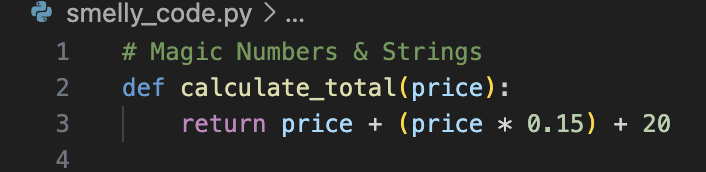

#### After

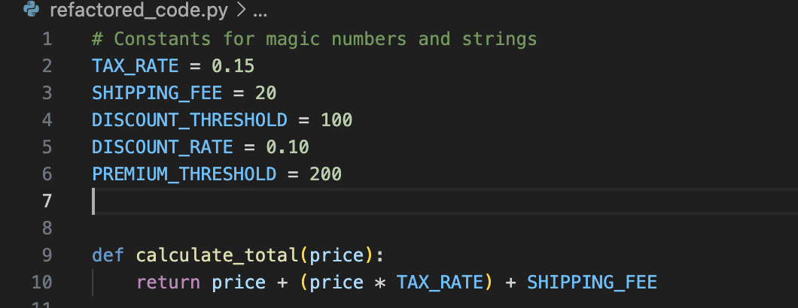

What I changed:
I replaced hardcoded values with named constants.

Impact:
The code is now easier to understand and update.

Debugging benefit:
If there is an issue in calculation, I can quickly verify constants instead of searching for hidden numbers.

### 2. Long Functions

Long functions often do too many things at once, such as calculations, printing, and decision-making. This reduces readability and makes debugging more difficult.

#### Before

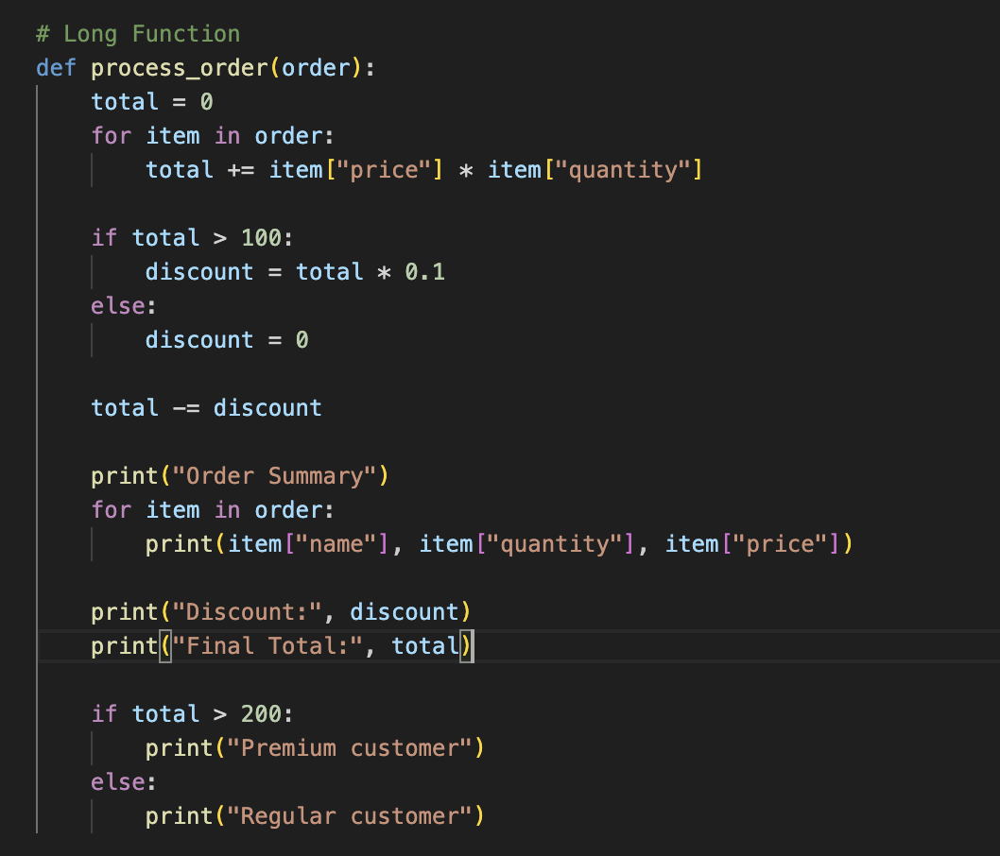

#### After

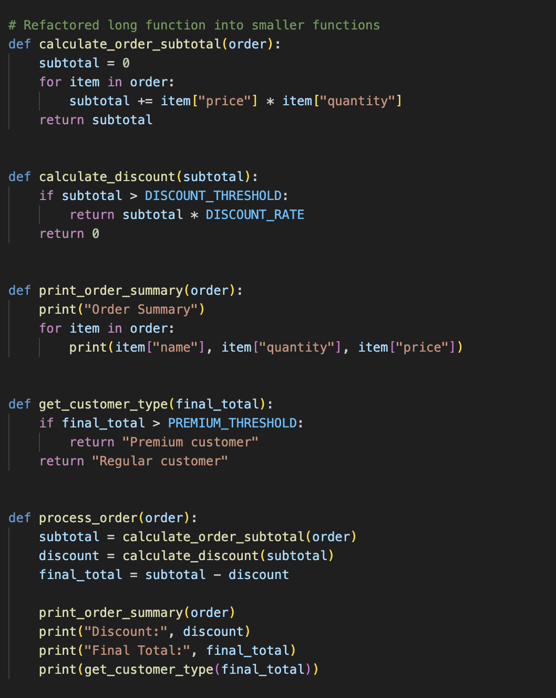

What I changed:
Split one large function into smaller functions.

Impact:
Improved readability and structure.

Debugging benefit:
Each part (subtotal, discount, customer type) can be tested independently.

### 3. Duplicate Code

Duplicate code happens when the same or very similar logic is copied into multiple places. This increases maintenance effort because every duplicate must be updated separately.

#### Before

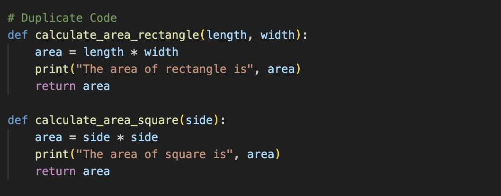

#### After

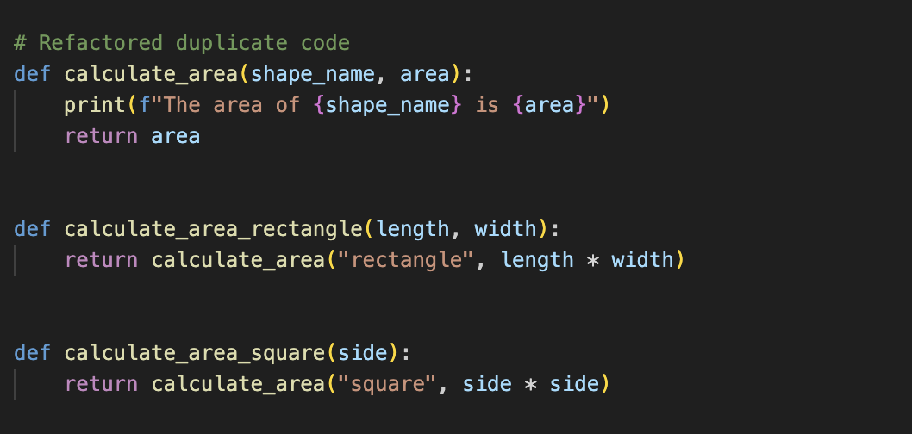

What I changed:
Created a reusable helper function.

Impact:
Reduced repetition and improved maintainability.

Debugging benefit:
Changes to output format only need to be done once.

### 4. Large Classes (God Objects)

A large class tries to handle too many responsibilities. This makes the class harder to understand, harder to test, and harder to maintain.

#### Before

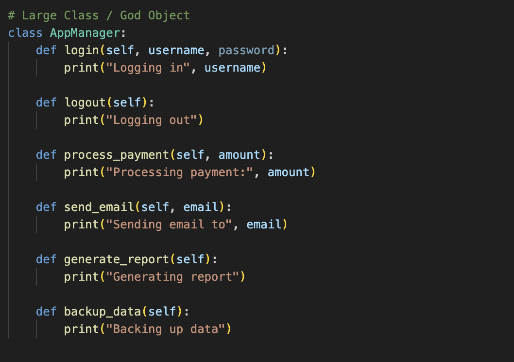

#### After

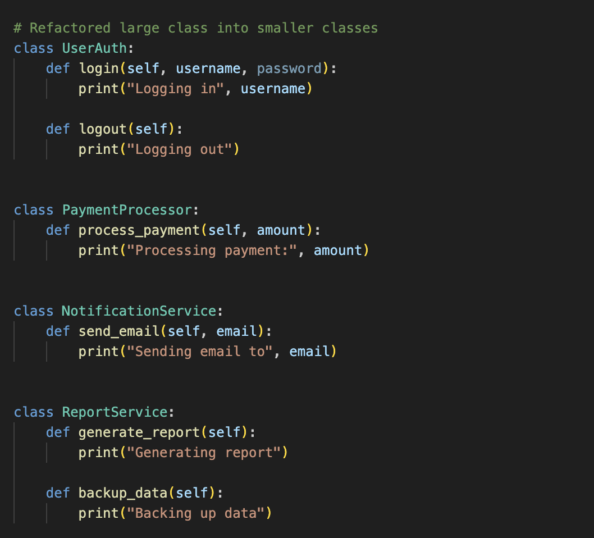

What I changed:
Split one large class into multiple smaller classes.

Impact:
Better structure and separation of concerns.

Debugging benefit:
Issues can be traced to specific classes instead of one large file.

### 5. Deeply Nested Conditionals

When many `if` and `else` statements are nested inside each other, the logic becomes difficult to follow and easier to break.

### Before

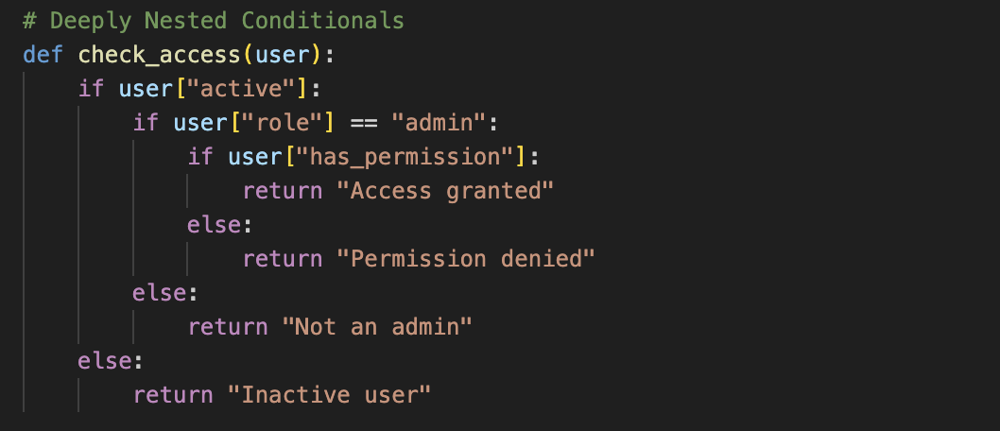

#### After

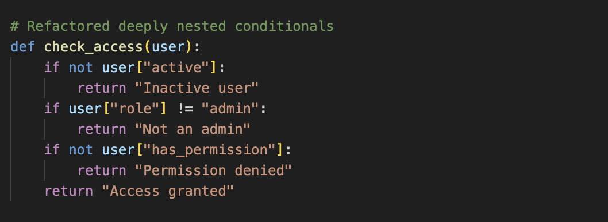

What I changed:
Used early returns instead of nested conditions.

Impact:
Cleaner and easier-to-read logic.

Debugging benefit:
Easier to identify which condition failed.

### 6. Commented-Out Code

Leaving old code commented out creates clutter and confusion. It makes the file harder to read and can distract from the actual working code.

### Before

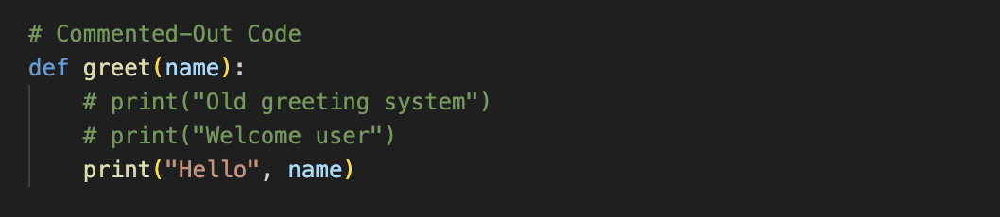

#### After

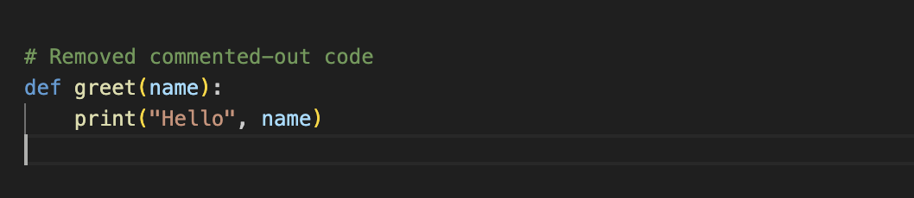

What I changed:
Removed unused commented code.

Impact:
Cleaner and more readable file.

### 7. Inconsistent Naming

Unclear variable and function names make the code less readable and force the reader to spend extra time figuring out what the code is doing.

### Before

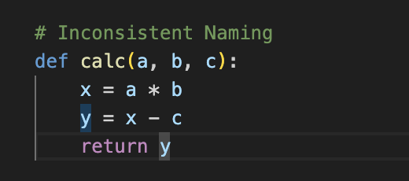

#### After

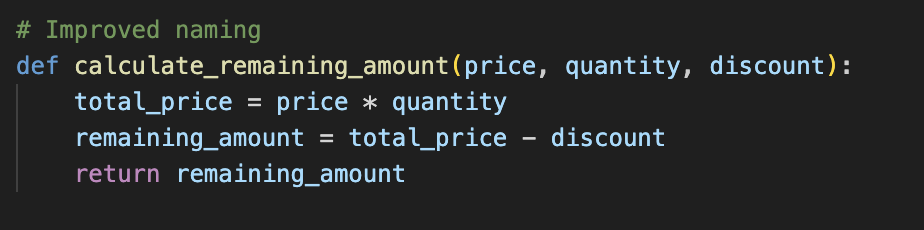

What I changed:
Improved function and variable names.

Impact:
Code is easier to understand without extra explanation.

## Refactoring Summary

I refactored the smelly code by replacing hardcoded values with constants, splitting long functions into smaller functions, removing duplicate logic, breaking a large class into smaller classes, simplifying nested conditionals, removing commented-out code, and improving variable and function names.

## Reflection

### What code smells did you find in your code?

The code smells I identified were magic numbers, long functions, duplicate code, a large class with too many responsibilities, deeply nested conditionals, commented-out code, and inconsistent naming. Each of these made the code harder to read and understand. Some parts of the code also felt harder to maintain because a small change would require editing multiple places or tracing through too much logic.

### How did refactoring improve the readability and maintainability of the code?

Refactoring made the code much easier to read because each function and class now has a clearer purpose. Replacing hardcoded values with constants made the logic easier to understand, and splitting long functions into smaller pieces made the code more organized. Removing duplication and improving naming also made the code more maintainable because future changes would be simpler and less error-prone.

### How can avoiding code smells make future debugging easier?

Avoiding code smells makes debugging easier because clean code is easier to follow. When functions are small, names are clear, and logic is not deeply nested, it becomes much faster to find where a problem is happening. It also reduces the risk of introducing new bugs when making changes, because the code structure is cleaner and more predictable..
