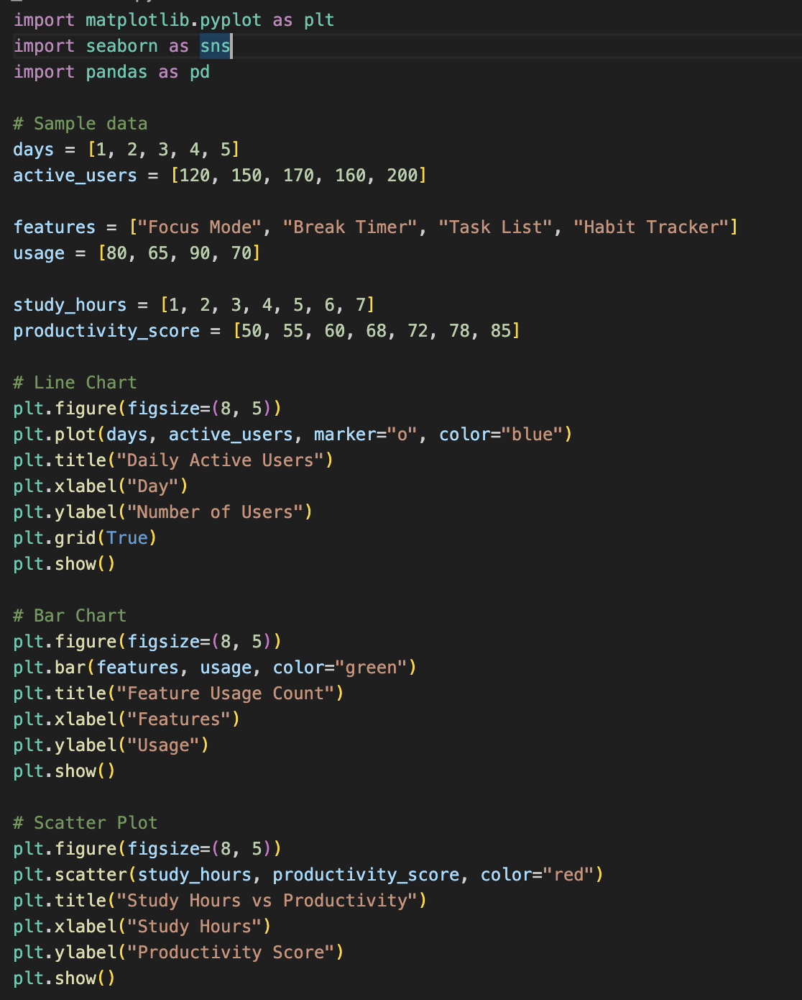
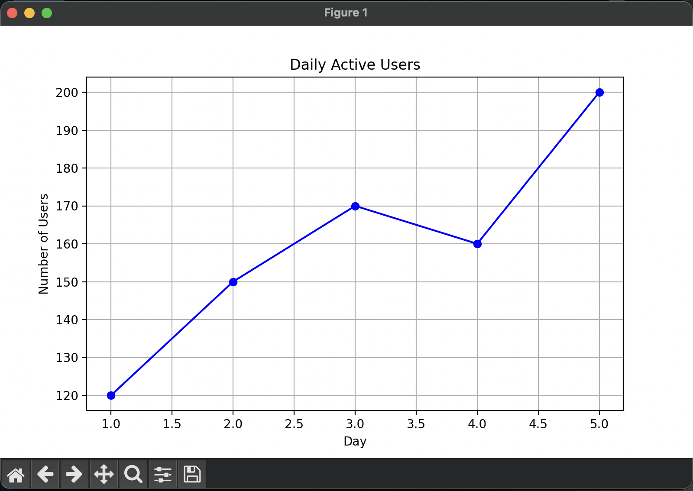
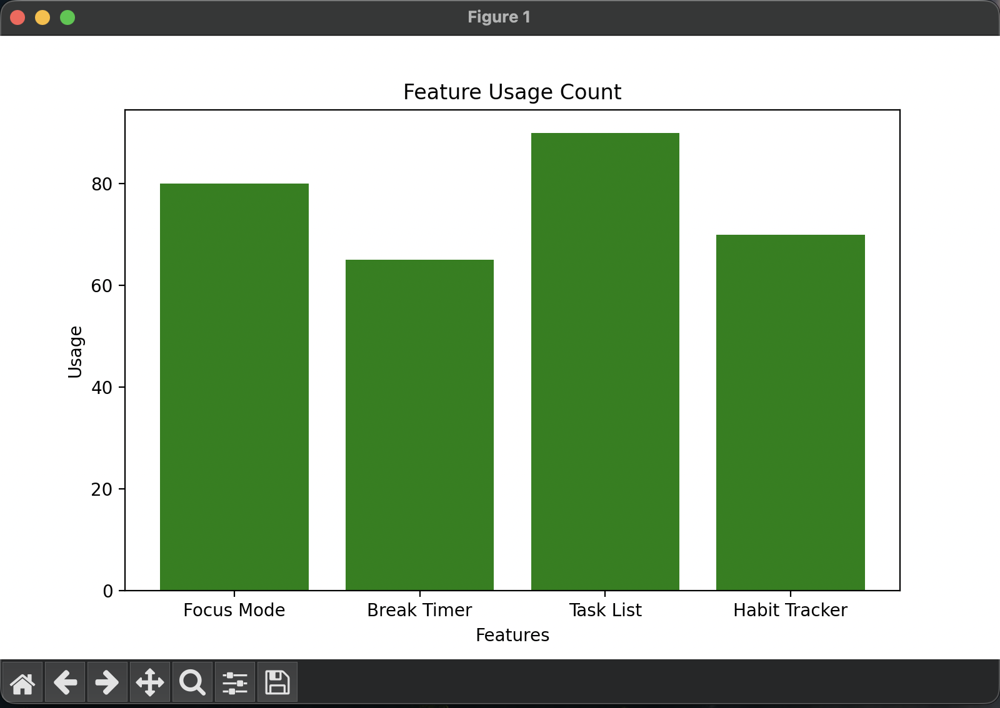
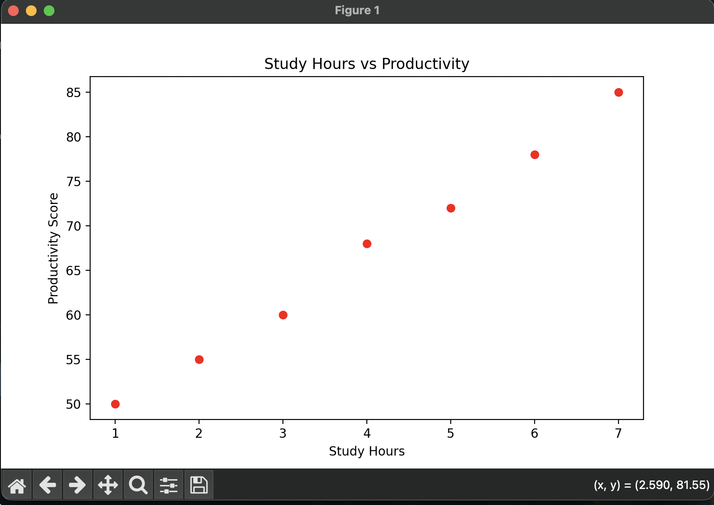
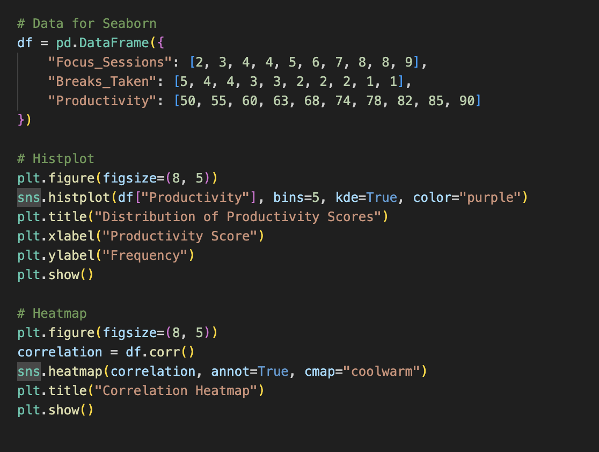
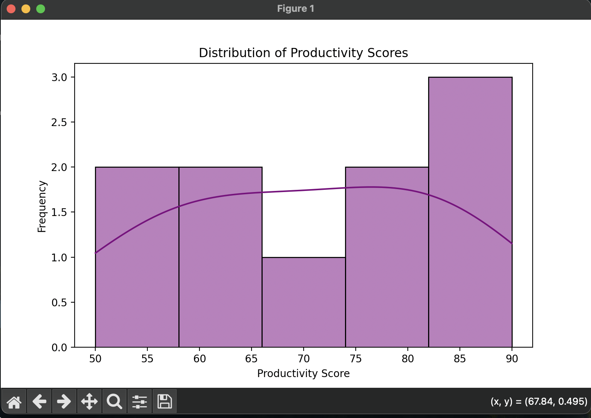
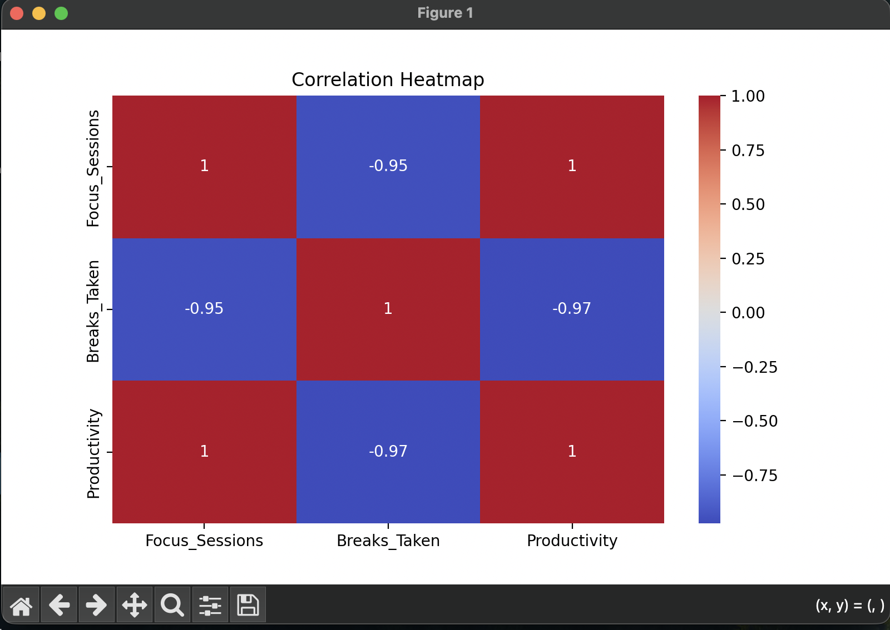

# Basic Charting & Data Visualization with Matplotlib & Seaborn

### Create a simple line chart, bar chart, and scatter plot using Matplotlib

### Line chart

### bar chart

### scatter plot

### Use Seaborn to visualize distributions and correlations (histplot, heatmap)

### histplot

### heatmap

## Reflection

## Why is data visualization important in analytics?

Data visualization is important in analytics because it helps turn raw numbers into something easier to understand. Instead of looking at large tables of data, charts make patterns, trends, and unusual changes much more visible. This helps people make faster and better decisions based on evidence. In a real product or business setting, good visualizations can make complex information clear for both technical and non-technical teams.

## What types of charts are most useful for different types of data?

Different charts are useful for different purposes. Line charts are very helpful for showing trends over time, such as daily active users or weekly engagement. Bar charts are useful when comparing categories, such as feature usage or user preferences. Scatter plots are good for showing relationships between two numeric variables, such as time spent studying and productivity. Histograms help show how values are distributed, and heatmaps are useful for understanding correlations between multiple variables at once.

## How do Seaborn’s advanced visualizations compare to Matplotlib’s basic charts?

Matplotlib is very useful for creating basic charts like line graphs, bar charts, and scatter plots, and it gives strong control over customization. Seaborn builds on top of Matplotlib and makes statistical visualizations easier and more attractive. It is especially helpful for charts like histograms with smooth distribution curves and heatmaps for correlation analysis. In simple words, Matplotlib is great for core chart building, while Seaborn makes advanced and cleaner-looking visualizations easier to create.

## How could Focus Bear use visualizations to improve product decision-making?

Focus Bear could use visualizations to better understand user behavior and improve product decisions. For example, line charts could show whether user engagement is increasing or dropping over time. Bar charts could compare which features are used the most, helping the team decide where to invest more effort. Histograms could show the distribution of session lengths, and heatmaps could help find relationships between habits, focus sessions, and productivity. These insights would help the team make more informed decisions about feature updates, user experience improvements, and retention strategies.
