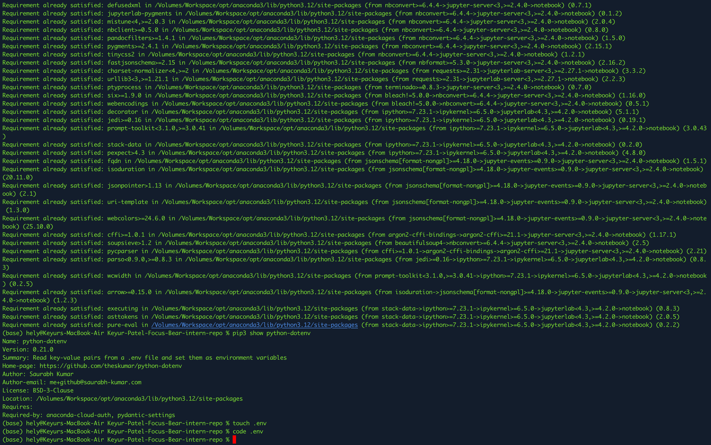
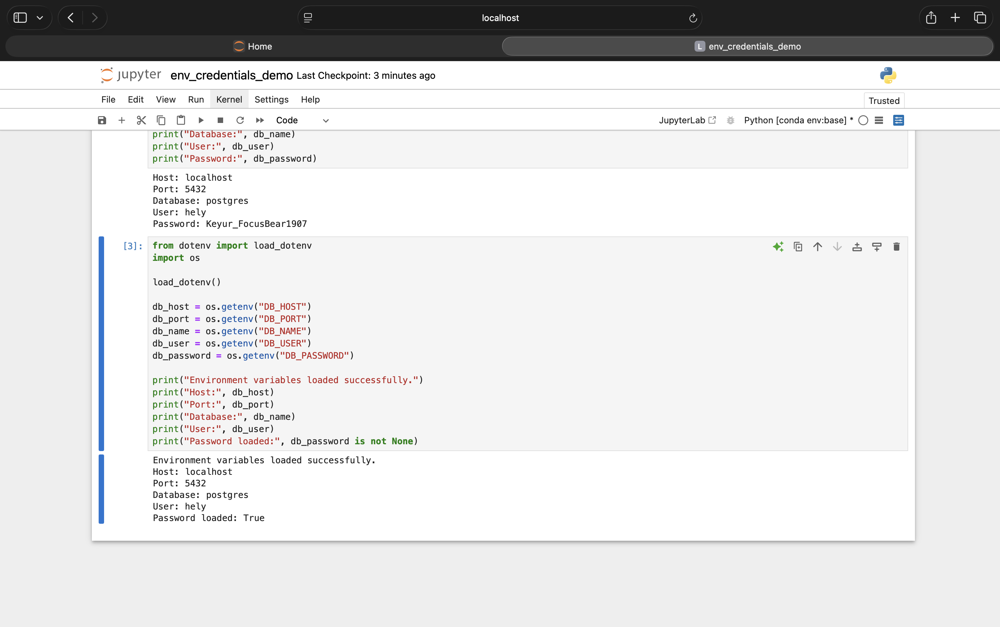

# Using .env to Keep Database Credentials Secret in Jupyter

### Why is it more secure to use a .env file for database credentials instead of hardcoding them?

Using a .env file is more secure because it keeps sensitive information like database usernames and passwords separate from the main code. When credentials are hardcoded directly into Python files or Jupyter notebooks, they can easily be exposed if the code is shared, uploaded to GitHub, or viewed by others. This creates a security risk, especially in real-world projects where credentials must be protected. By storing them in a .env file, developers can prevent accidental leaks and also exclude the file from version control using .gitignore. This approach ensures that sensitive data remains private while still allowing the code to be shared safely. It also makes it easier to manage different environments (like development and production) without changing the actual code.

### How can python-dotenv simplify managing environment variables in Jupyter?

The python-dotenv library makes it much easier to work with environment variables in Jupyter notebooks by automatically loading values from a .env file into the Python environment. Instead of manually setting variables each time or writing sensitive information directly in the notebook, we can simply use load_dotenv() to access all variables securely. This keeps the notebook clean, readable, and more professional. It also reduces errors because we only need to update values in one place (the .env file) rather than changing multiple parts of the code. Overall, python-dotenv simplifies the workflow by making environment variable management consistent, reusable, and secure, especially when working on data analysis or database connections in Jupyter.

## Proof

