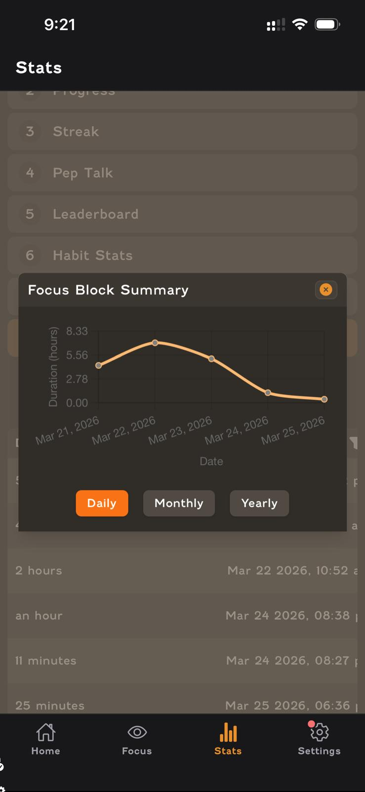
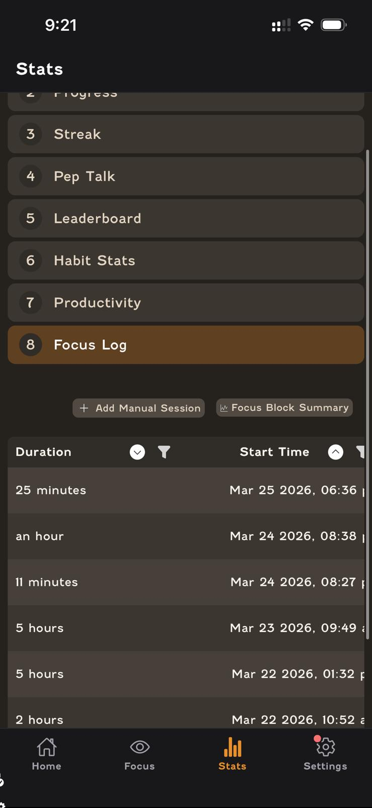
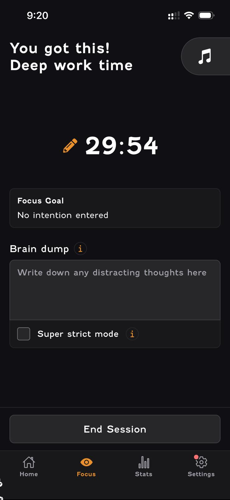
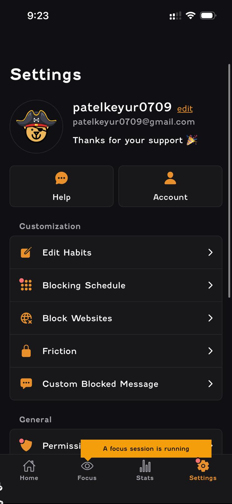
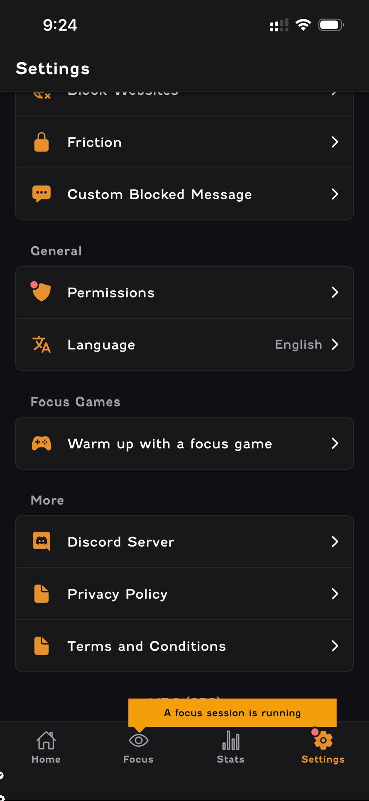
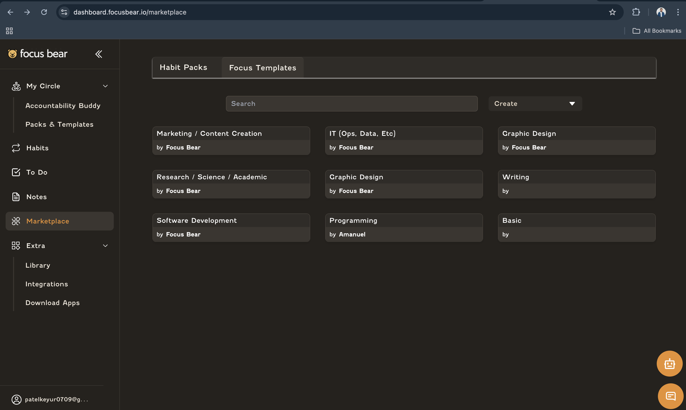

# First-Time User Experience – Focus Bear

## Overview

I explored the Focus Bear mobile and web applications as a new user, focusing on real interactions such as focus sessions, stats, settings, and help features. This report highlights usability issues observed during actual usage and provides actionable improvement suggestions.

### Issue 1: Permission Warning Lacks Clear Guidance

📸 Screenshot:

Problem:

The app displays a warning:
“Blocking disabled: Permissions not granted (tap here to fix)”, but it does not clearly explain what specific permission is required or how to enable it.

Why this is a problem:
A new user may not understand:

    What permission is missing
    Why it is important
    How to fix it

This creates friction early in the experience.

Improvement:
Provide a step-by-step guide when tapped

Example:
“Go to Settings → Enable Screen Time → Allow Focus Bear”
Add a short explanation: “This is required to block distracting apps”

### Issue 2: Focus Mode Features Are Not Self-Explanatory

📸 Screenshot:

Problem:
Features such as:

    “Brain dump”
    “Super strict mode”

are shown without explanation.

Why this is a problem:
Users may not understand:

    When to use these features
    How they improve focus

This reduces feature adoption.

Improvement:
Add tooltip/info icon

Example:
Brain dump → “Write distracting thoughts here to stay focused”
Super strict mode → “Blocks all non-essential apps”

### Issue 3: Stats Section Lacks Meaningful Context

📸 Screenshot:

Problem:
The stats section includes multiple categories:

    Goals
    Streak
    Productivity
    Focus log

However, there is no explanation of what each metric represents.

Why this is a problem:
Users cannot easily interpret:

    Their progress
    What they are doing well
    What needs improvement

Improvement:
Add info icons or short descriptions

Example:
“Streak = consecutive days completing habits”

### Issue 4: Focus Log and Data Presentation Are Not Intuitive

📸 Screenshot:

Problem:
The focus log displays session durations and timestamps, but:

    There is no summary or insight
    No indication of productivity trends

Why this is a problem:
Raw data without interpretation is difficult for users to understand.

Improvement:
Add insights such as:
“You are most productive in the morning”
Add weekly summary or highlights

### Issue 5: Focus Block Summary Graph Lacks Clarity

📸 Screenshot:

Problem:
The graph shows data (daily, monthly, yearly), but:

    No labels or explanation of trends
    No actionable insights

Why this is a problem:
Users may not understand what the graph is telling them.

Improvement:
Add labels and highlights:
“Peak productivity on March 22”
Add simple explanation below graph

### Issue 6: Settings Options Are Not Clearly Explained

📸 Screenshot:

Problem:
Settings include advanced options like:

    Blocking Schedule
    Friction
    Custom Blocked Message

But there is no explanation of how these impact the app.

Why this is a problem:
Users may avoid using these features due to confusion.

Improvement:
Add short descriptions under each option
Highlight recommended settings for new users
