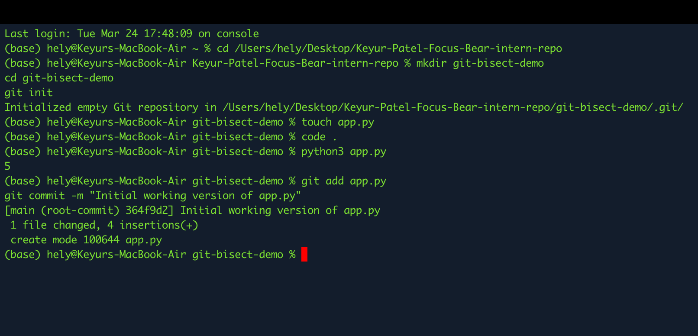
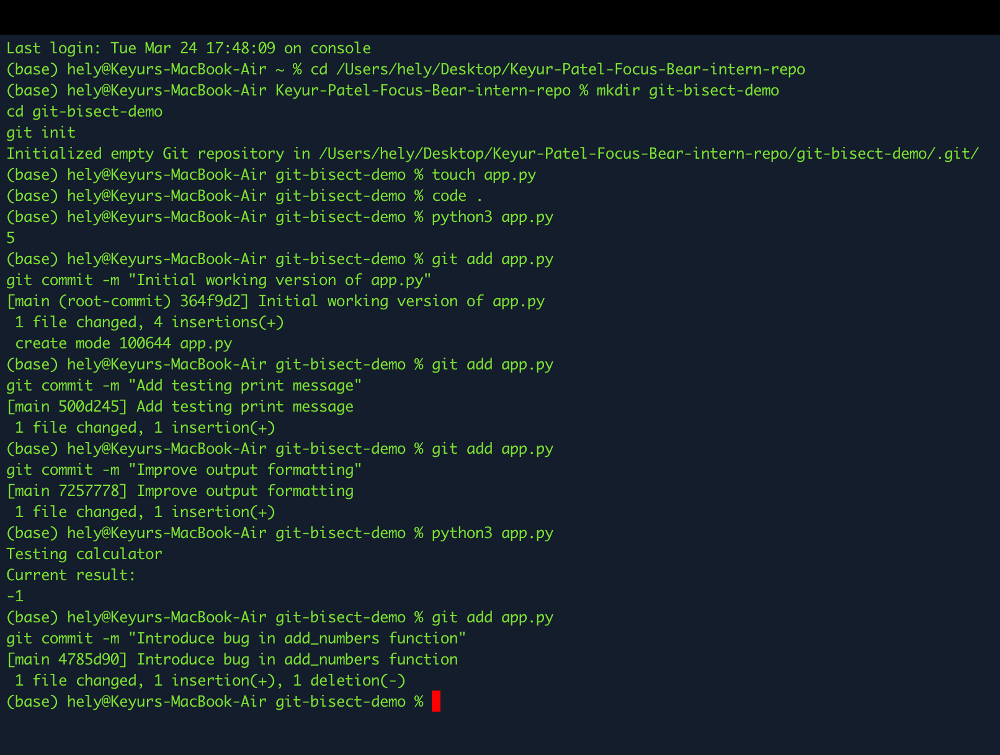
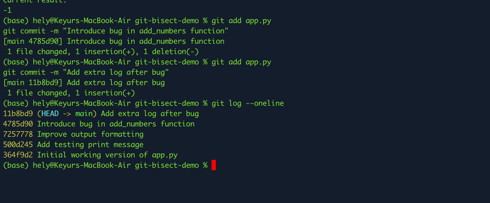
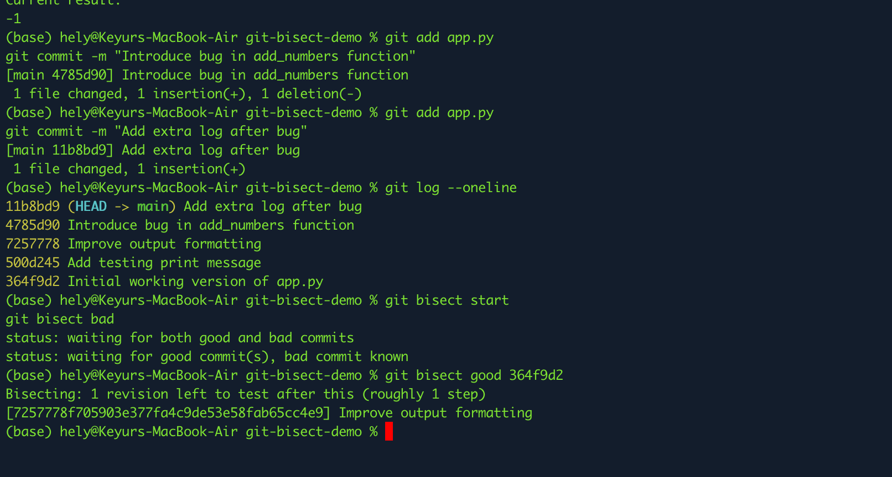
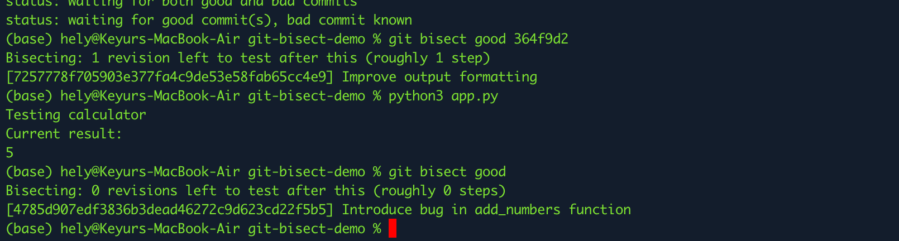
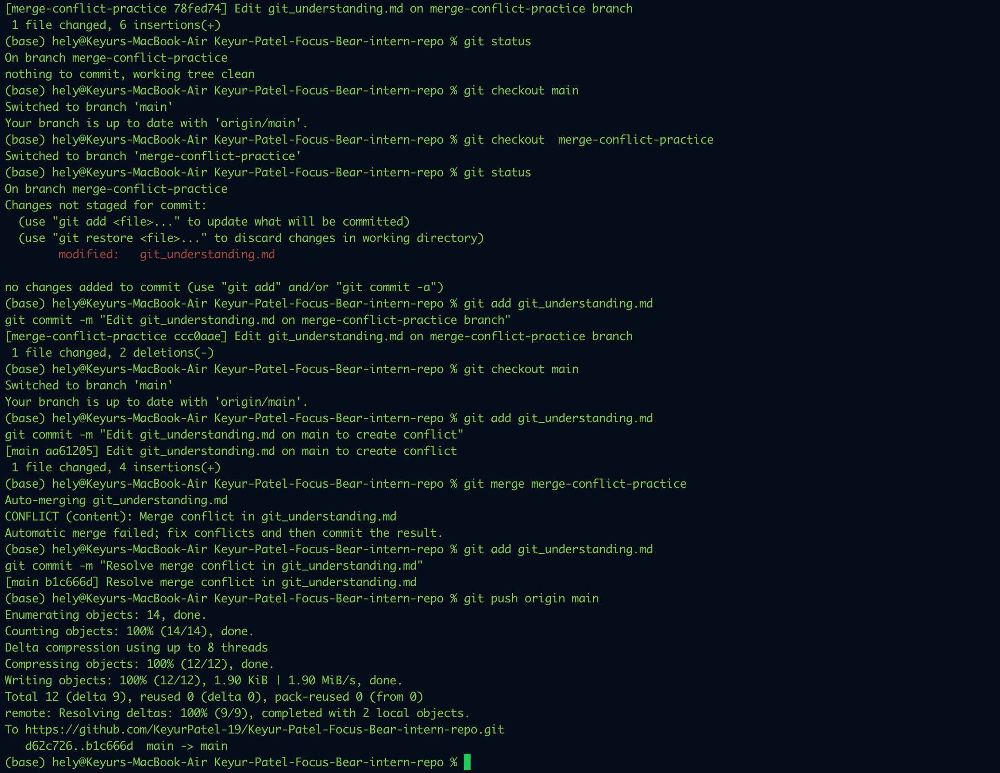

# Git Concepts: Staging vs. Committing

## Write a summary in git_understanding.md:

### What is the difference between staging and committing?

In Git, staging and committing are two separate steps used to save changes in a project.

Staging means preparing specific changes that you want to include in the next commit. When you stage a file using git add, Git moves those changes into the staging area, which acts like a temporary space where you select what will be included in the next snapshot of your project.

Committing means permanently saving the staged changes into the Git repository. When you run git commit, Git records those staged changes along with a commit message that explains what was modified.

In simple terms, staging selects the changes, and committing saves them to the project history.

### Why does Git separate these two steps?

Git separates staging and committing to give developers more control over what gets saved in each commit. Sometimes a developer may change several files but only want to save certain changes at a time. The staging area allows you to carefully choose which modifications should be included in a commit.

This helps keep commits clean, organized, and meaningful, which is important when working in teams or when reviewing project history later.

### When would you want to stage changes without committing?

There are several situations where staging changes without committing can be useful. For example, if you modify multiple files but only want to commit some of them first, you can stage only the relevant files while leaving others unstaged.

It is also helpful when reviewing changes before saving them. By staging files and checking git status, you can confirm exactly what will be included in the next commit. If something is staged by mistake, it can easily be unstaged before committing.

This process helps ensure that commits remain clear, accurate, and well-structured.

## Branching & Team Collaboration

Branches help developers work on changes safely without affecting the main version of the project.

## Branching & Team Collaboration Reflection

### Why is pushing directly to main problematic?

Pushing directly to main is risky because it can affect the stable version of the project immediately. If the code has a mistake, bug, or incomplete work, it can create problems for the whole team. It also makes collaboration harder because important changes go live without proper checking.

### How do branches help with reviewing code?

Branches give developers a safe space to work on their own changes without disturbing the main project. Once the work is ready, it can be reviewed before merging. This makes it easier to catch mistakes, improve code quality, and discuss changes with the team.

### What happens if two people edit the same file on different branches?

If two people edit the same part of the same file on different branches, Git may create a merge conflict when the branches are merged. This means Git cannot decide which change should be kept automatically, so the conflict must be resolved manually.

## Cherry-pick test

This line was added on the cherry-pick-test branch.

## Advanced Git Commands & Reflection

## What does each command do?

### git checkout main -- <file>

This command restores a specific file from the main branch without changing the rest of the branch. I would use it when I accidentally edit one file and want to bring back the clean version from main without losing my other work.

### git cherry-pick <commit>

This command applies one specific commit from another branch onto the current branch. I would use it in a real project when I only need one useful fix or feature from another branch and do not want to merge everything from that branch.

### git log

This command shows the commit history of the repository. I would use it to understand what changes were made over time, who made them, and to find commit IDs for other Git operations.

### git blame <file>

This command shows who last modified each line in a file and when. I would use it in a real project when I want to understand why a certain line was changed or find the right person to ask about that code.

## When would you use it in a real project (hint: these are all really important in long running projects with multiple developers)?

In a real project, I would use these commands to safely manage changes, track project history, restore files, and bring in only the exact fixes I need without disturbing other team members’ work.

## What surprised me while testing these commands?

What surprised me was how powerful Git is for handling specific changes without affecting the whole project. I found cherry-pick especially interesting because it lets me move only one commit instead of merging an entire branch. I also found git blame useful because it gives clear history at the line level, which can be very helpful in team projects.

---

# Understand git bisect

### What is git bisect?

git bisect is a Git tool that helps you find which commit introduced a bug.

Instead of checking every commit one by one, Git uses a binary search approach:

you tell Git one commit is good
you tell Git one commit is bad
Git checks a commit in the middle
you test it and say good or bad
Git keeps narrowing it down until it finds the exact commit

This is helpful in debugging because it saves time when a project has many commits.

# Git Bisect Practical Demonstration

## Test Repository

For this task, I created a test repository inside my internship project:

git-bisect-demo

This repository contains a simple Python file (`app.py`) used to simulate a bug and test how git bisect works in practice.

## Bug Description

Initially, I created a working function:

```python
def add_numbers(a, b):
    return a + b

print(add_numbers(2, 3))
```

This correctly returned:

5

Later, I introduced a bug by changing the logic to:

```python
return a - b
```

This caused incorrect output:

-1

## Commit History

I created multiple commits to simulate a real development workflow:

- Initial working version of app.py
- Add testing print message
- Improve output formatting
- Introduce bug in add_numbers function
- Add extra log after bug

This allowed git bisect to search through multiple commits.

## Git Bisect Commands Used

Below are the commands I used during the bisect process:

```bash
cd git-bisect-demo
git log --oneline

git bisect start
git bisect bad
git bisect good 364f9d2

python3 app.py
git bisect good

python3 app.py
git bisect bad

git bisect reset
```

## Terminal Output (Evidence)

Below is a sample of my actual terminal session:

```bash
$ git log --oneline
11b8bd9 Add extra log after bug
4785d90 Introduce bug in add_numbers function
7257778 Improve output formatting
500d245 Add testing print message
364f9d2 Initial working version of app.py

$ git bisect start
$ git bisect bad
$ git bisect good 364f9d2

Bisecting: 1 revision left to test after this

$ python3 app.py
Testing calculator
Current result:
5

$ git bisect good

Bisecting: 0 revisions left to test after this

$ python3 app.py
Testing calculator
Current result:
-1

$ git bisect bad
4785d90 is the first bad commit
```

## Result

Git bisect successfully identified the following commit as the first bad commit:

4785d90 Introduce bug in add_numbers function

This confirms that this commit introduced the bug in the program.

## Screenshots (Evidence)











## Resetting Bisect

After completing the process, I reset the repository using:

```bash
git bisect reset
```

This returned the repository to the latest commits.

## Reflection

This practical task helped me clearly understand how git bisect works. Instead of manually checking every commit, git bisect uses a binary search approach to quickly identify the commit that introduced a bug.

By creating my own test scenario and running the commands step by step, I was able to see how efficient and useful this tool is. It makes debugging much faster, especially in projects with many commits. I now feel confident using git bisect to track down issues in real development scenarios.

### What does git bisect do?

git bisect helps find the exact commit that introduced a bug by using binary search. Instead of checking every commit manually, Git checks commits in between a known good commit and a bad commit until it identifies the first bad one.

### When would you use it in a real-world debugging situation?

I would use git bisect when a project suddenly starts failing, but I do not know which commit caused the issue. It is especially useful in projects with many commits and multiple developers because it saves time and makes debugging more systematic.

### How does it compare to manually reviewing commits?

git bisect is much faster and more efficient than manually reviewing commits one by one. Manual checking can take a long time and is easy to get confused with, while git bisect narrows the problem down quickly and gives a more reliable result.

---

# Writing Meaningful Commit Messages

## Best practices

- Keep the message clear and specific.
- Describe what changed.
- Use imperative tone, such as "Add", "Fix", or "Update".
- Keep the first line short and readable.
- Avoid vague messages like "fixed stuff".

## Commit style test 1

Testing a vague commit message.

## Commit style test 2

Testing an overly detailed commit message.

## Reflection

### What makes a good commit message?

A good commit message is short, clear, and specific. It should explain what changed in a way that is easy for others to understand later.

### How does a clear commit message help in team collaboration?

A clear commit message helps team members quickly understand changes without opening every file. It makes reviews, debugging, and project history easier to follow.

### How can poor commit messages cause issues later?

Poor commit messages make it hard to understand why a change was made. This can slow down debugging, confuse teammates, and make project history less useful.

## Pull Request Reflection

### Why are PRs important in a team workflow?

Pull requests allow developers to review code before it is merged into the main branch. This helps teams detect mistakes early and maintain better code quality.

### What makes a well-structured PR?

A good pull request has a clear title, explanation of the changes, and small focused updates so reviewers can easily understand what was modified.

### What did you learn from reviewing an open-source PR?

I learned that developers actively discuss code improvements, suggest fixes, and approve changes before merging. It showed me that collaboration and feedback are essential parts of software development.

---

# Merge Conflicts & Conflict Resolution

## Git helps teams collaborate on shared code, track changes clearly, and work in an organized way.

### Write about your experience in git_understanding.md:

### What caused the conflict?

The conflict happened because I edited the same line in git_understanding.md on two different branches. First, I changed the line in my practice branch. Then I switched back to main and changed that same line differently. When I tried to merge the branch back into main, Git detected that both versions were different and could not merge them automatically.

### How did you resolve it?

I resolved the conflict by opening the file and reviewing both versions of the text. Git showed the conflicting changes with conflict markers, which helped me see exactly where the problem was. I then removed the markers, wrote one final combined sentence that made sense, saved the file, staged it, and created a new commit to complete the merge.

### What did you learn?

This activity helped me understand that merge conflicts are a normal part of working with Git, especially when multiple people edit the same file. I learned how important it is to read the conflict carefully instead of rushing. I also learned that Git does not lose the work it simply asks me to choose the final version. Overall, this made me more confident in handling branch merges and fixing conflicts properly.

### Proof


