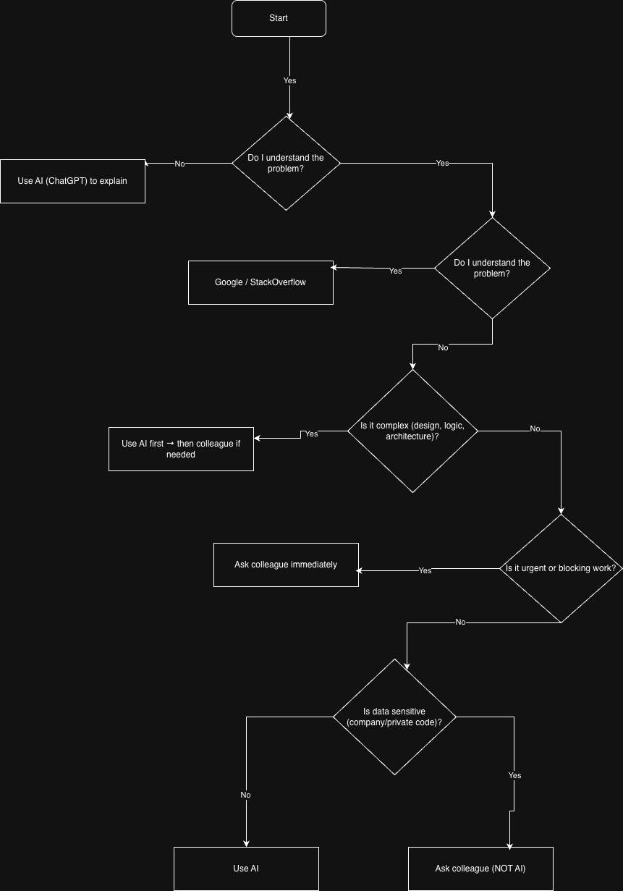

# When you get stuck - what next?

## flow chart

## When do you prefer using AI vs. searching Google?

I prefer using AI tools like ChatGPT when I don’t understand a concept or need a clear explanation. AI is helpful because it gives direct answers and can explain things step by step in a simple way.

On the other hand, I use Google when I face specific errors, such as syntax issues or error messages. Google helps me find real-world solutions from developers on platforms like Stack Overflow.

## How do you decide when to ask a colleague instead?

I decide to ask a colleague when the problem is taking too long to solve or blocking my progress. If the issue is complex, related to system design, or involves project-specific logic, asking a teammate is more efficient.

I also avoid using AI tools when the data is sensitive or related to private code. In such cases, asking a colleague is the safer option.

## What challenges do developers face when troubleshooting alone?

Developers often face frustration when they cannot find the root cause of a problem. Sometimes, they may spend too much time searching without making progress.

Another challenge is misunderstanding the problem, which leads to incorrect solutions. Working alone can also reduce productivity because there is no quick feedback or second opinion.

Having a clear strategy of when to use AI, Google, or ask for help can save time and improve problem-solving efficiency.
