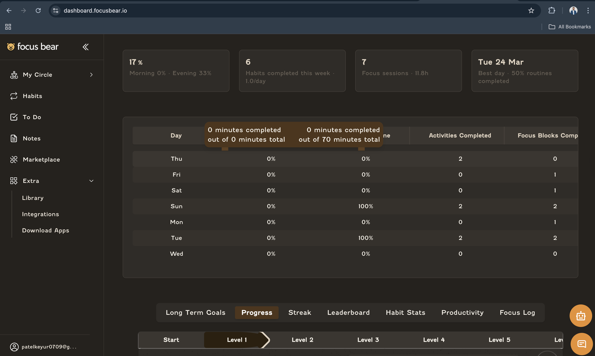
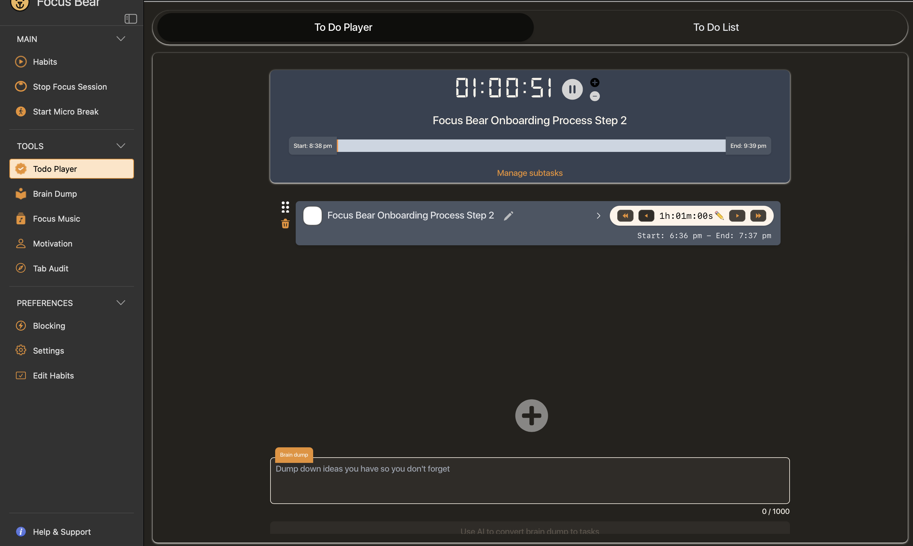

# Internship Time Plan

## Proof

The following screenshots show my Focus Bear usage and logged sessions:

## Internship Requirement

As part of the Swinburne postgraduate internship program, I am required to complete **180 hours** of internship work. To ensure I meet this requirement, I have created a weekly schedule that outlines when I will work on internship tasks.

## Weekly Work Plan

### 28 Feb 2026, Sat

Time: 3:00 PM – 3:45 PM  
Location: Home
Task: Onboarding process step 1: Duplicating the Repo

### 03 Mar 2026, Tue

Time: 2:00 PM – 3:00 PM  
Location: Home
Task: Onboarding process step 2, Milestone 0: Working in Agile Team, Download Focus Bear app and star record timelogs.

### 07 Mar 2026, Sat

Time: 1:00 PM – 2:00 PM  
Location: Home
Task: Onboarding process step 2, Milestone 0: Company Policies

### 08 Mar 2026, Sun

Time: 11: 00 AM - 12: 00 AM
Location: Home
Task: Onboarding process step 2, Milestone 0: Company Policies

### 09 Mar 2026, Mon

Time: 1: 15 PM - 2: 15 PM
Location: Home
Task: Onboarding process step 2, completing remaining issues on company plocies

### 11 Mar 2026, Wed

Time: 8: 30 PM - 9: 30 PM
Location: Home
Task: Onboarding process step 2, Milestone 1: Understanding of Focus Bear's Mission and Vission

### 13 Mar 2026, Fri

Time: 10: 30 AM - 01: 30 PM
Location: Monash Focus Bear
Task: Onboarding process step 2, Milestone 1: Learning about focus bear and set your goals and Milestone 2: Set up tools.

### 14 Mar 2026, Sat

Time: 5: 30 PM - 7 : 30 PM
Location: Home
Task: Onboarding process step 2, Milestone 2 Set up tools and 3 Learn git

### 15 Mar 2026, Sun

Time: 09:30 AM to 12:30 PM and 06: 00 PM to 07: 00 PM
Location: Home
Task: Onboarding process step 2, Milestone 3 Learn git

### 16 Mar 2026, Mon

Time: 12: 20 PM to 02: 20 PM
Location: Swinburne LateLab
Task: Onboarding process step 2, Milestone 3

### 20 Mar 2026, Fri

Time: 8: 10 AM to 11: 10 AM
Location: Home
Task: Onboarding process step 2, Milestone 4

### 21 Mar 2026, Sat

Time: 9: 00 AM to 01: 30 PM
Location: Home
Task: Onboarding process step 2, Milestone 4

### 22 Mar 2026, Sun

Time: 11: 00 AM to 03: 30 PM
Location: Home
Task: Onboarding process step 2, Milestone 5
