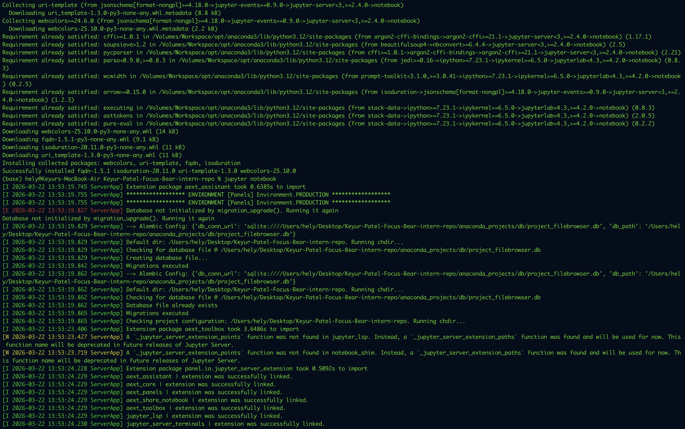
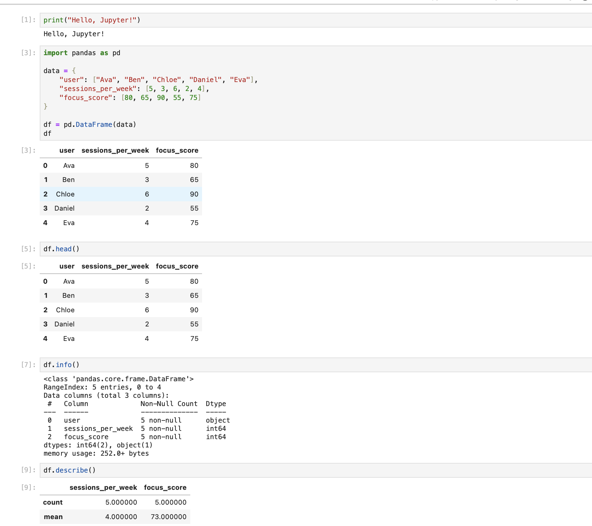
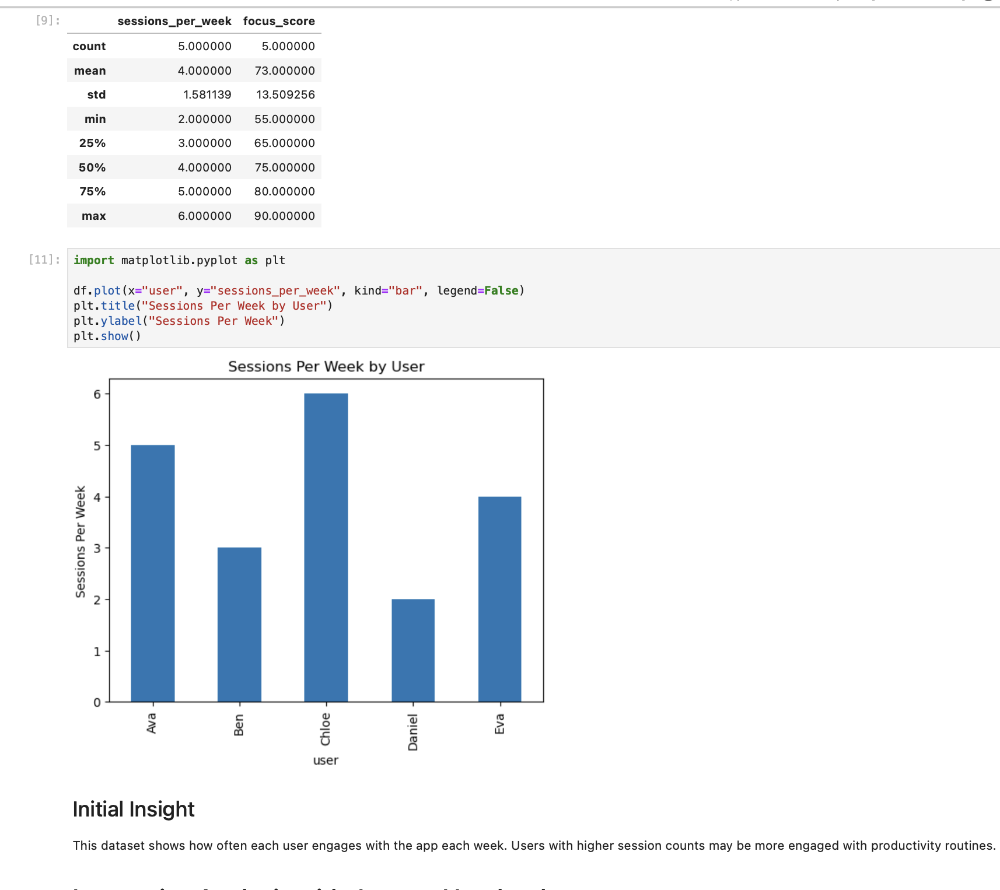
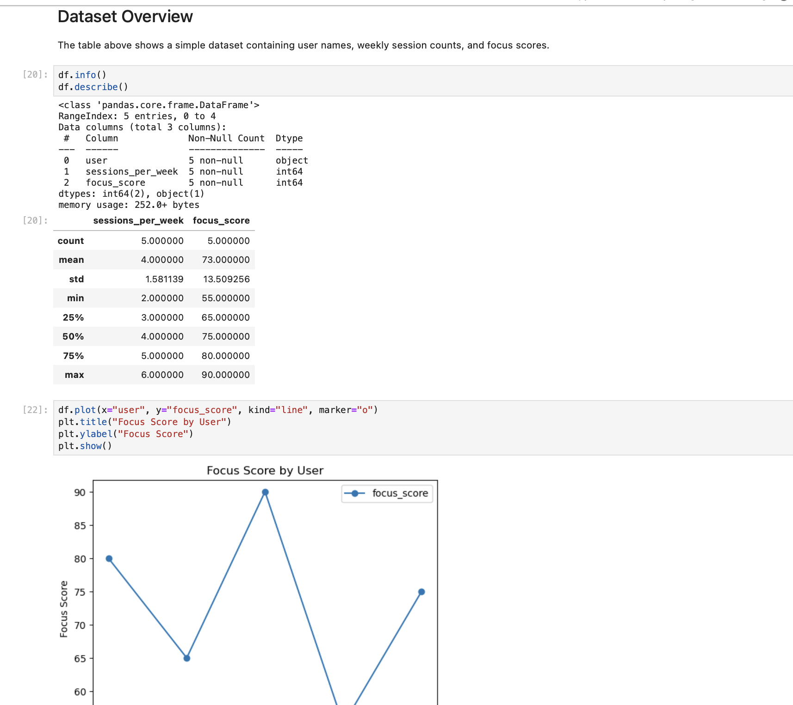

# Using Jupyter Notebooks for Interactive Analysis

## Tasks

## Reflection

### What are the advantages of using Jupyter Notebooks for data analysis?

One major advantage of Jupyter Notebooks is that they make analysis interactive. I can run one cell at a time, check the result immediately, and then decide what to do next. This is very helpful when cleaning data, testing code, or building visualizations because I do not need to rerun the entire program every time I make a small change.

Another advantage is that Jupyter keeps code, output, and explanation together in the same file. This makes the work much easier to read and understand, both for me and for anyone else reviewing it later. It is especially useful for learning, experimenting, and sharing analysis in a clear format.

### How does Jupyter improve workflows compared to writing standalone Python scripts?

Compared to standalone Python scripts, Jupyter makes the workflow much more flexible. In a normal script, I usually write the full program first and then run everything together. If there is an error in the middle, I may need to go back, fix it, and run the whole file again. In Jupyter, I can test smaller parts one by one, which saves time and makes debugging easier.

Jupyter also helps with exploration. If I want to quickly inspect a dataset, test a chart, or compare outputs, I can do that in separate cells without affecting the whole notebook. This makes the workflow smoother and more practical for data analytics tasks.

### What are Markdown cells, and why are they useful in notebooks?

Markdown cells are text cells that allow me to write headings, notes, explanations, and observations inside the notebook. They are useful because they help organize the notebook and explain what each section of code is doing.

Instead of only showing raw code, Markdown makes the notebook more understandable and professional. It allows me to document my process, describe the dataset, explain my findings, and present insights in a way that is easy for others to follow.

### How could Jupyter Notebooks be used for analyzing Focus Bear’s user trends?

Jupyter Notebooks could be very useful for analyzing Focus Bear’s user trends because they allow quick exploration of user data such as session frequency, retention, feature usage, or productivity habits. For example, I could load user activity data into a notebook, inspect patterns, and create charts to see which features are used most often.

Jupyter would also help with testing ideas before building final dashboards or reports. I could compare trends over time, identify unusual patterns, and write notes about possible insights directly beside the code and charts. This would make it easier to understand user behavior and support better product decisions.
