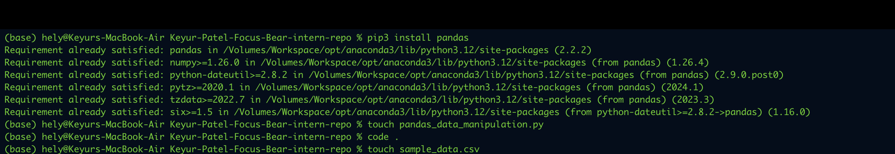
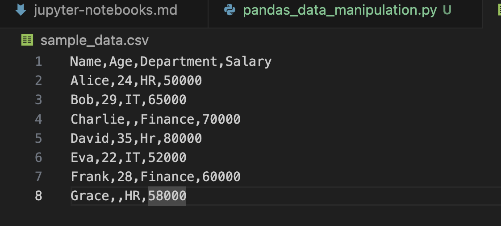
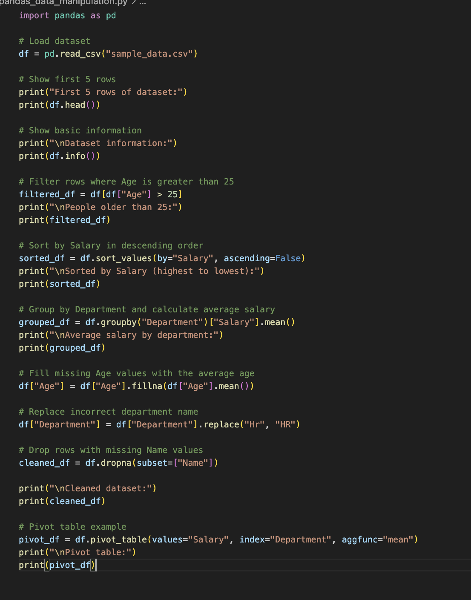
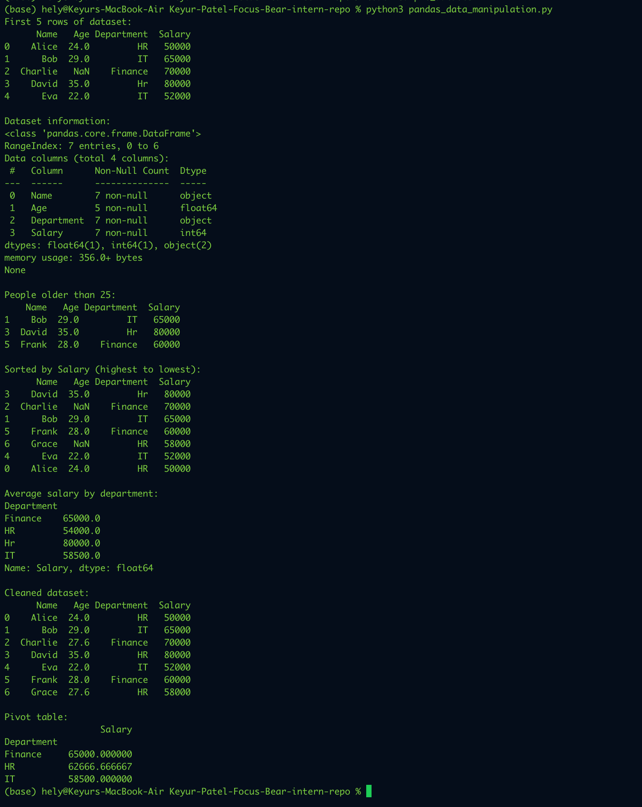

# Data Manipulation with Pandas

## Tasks

## Reflection

### What are the advantages of using Pandas for data manipulation?

Pandas is very useful for data manipulation because it makes working with datasets much faster and easier. Instead of writing long and complex code, I can use simple Pandas functions to load, clean, filter, sort, and analyze data. It is especially helpful when handling large datasets because everything is organized in a table-like structure called a DataFrame. I also found that Pandas saves a lot of time and makes the code more readable, which is important when working on real analytics tasks.

### How do you filter and aggregate data in Pandas?

In Pandas, filtering data is done by selecting only the rows that match a condition. For example, I can filter rows where age is greater than 25 or where a department is IT. Aggregating data means summarizing it, such as calculating the average salary, total sales, or number of users in each group. This is usually done with functions like groupby(), mean(), sum(), and count(). These features make it easy to find patterns and insights from raw data.

### What techniques help handle missing or incorrect data?

Missing or incorrect data can be handled in Pandas using several useful methods. For missing values, I can use fillna() to replace them with something meaningful, such as the average or a default value. I can also use dropna() if I want to remove rows or columns with missing data. For incorrect values, replace() is helpful because it can correct spelling mistakes or inconsistent labels. These techniques are important because clean data leads to more accurate analysis and better results.

### How would Pandas be useful for analyzing Focus Bear’s user activity data?

Pandas would be very useful for analyzing Focus Bear’s user activity data because it can quickly organize and process large amounts of user information. For example, it could be used to track how often users complete focus sessions, which features they use most, how long they stay active, and where they drop off. It can also help clean missing or inconsistent data before analysis. Overall, Pandas would make it easier to turn raw user activity data into clear insights that support better product decisions.
