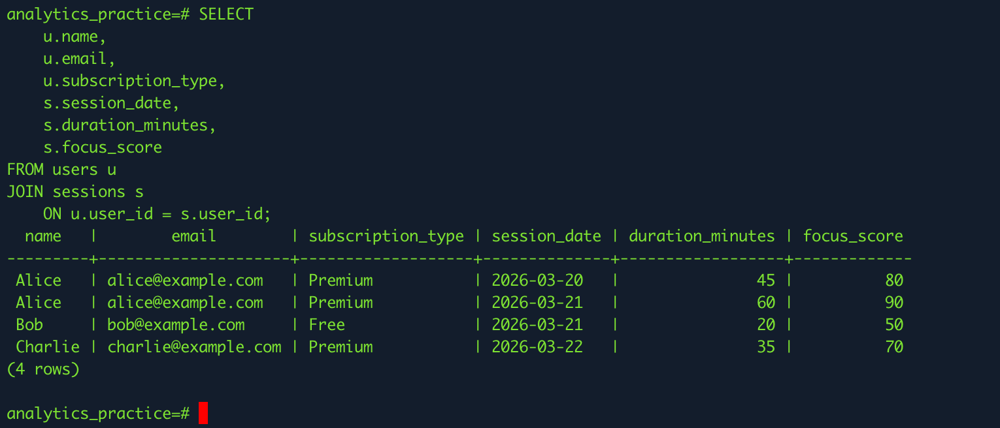
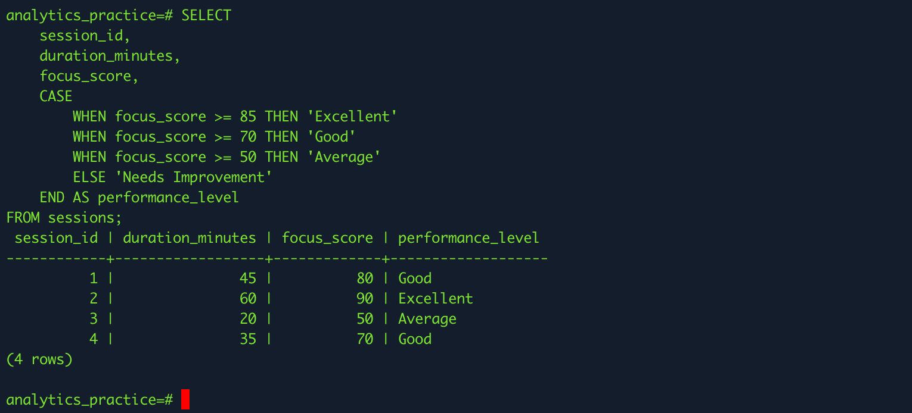
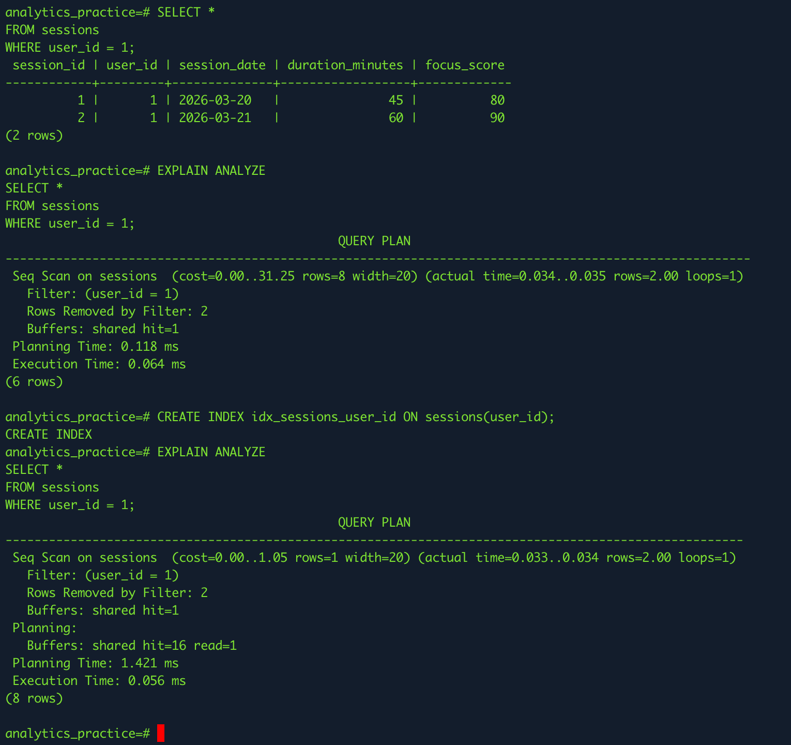

# Using PostgreSQL for Analytics

## Tasks

### Research PostgreSQL’s features for analytics (window functions, indexing, JSON support)

### 1. PostgreSQL features for analytics

PostgreSQL is very useful for analytics because it supports advanced SQL features that help work with large and structured datasets.

#### Window Functions

Window functions allow us to calculate values across a group of rows without collapsing the result into a single row. They are useful for ranking, running totals, averages, and comparing rows. For example, we can rank users by focus score or calculate average session duration by user.

#### Indexing

Indexing improves query performance by helping PostgreSQL find rows faster. This is especially useful when working with large datasets. If a table has many records, adding an index on commonly searched columns such as user_id or session_date can make filtering and joins much faster.

#### JSON Support

PostgreSQL supports JSON and JSONB, which allows semi-structured data to be stored inside database tables. This is very useful when application data does not always follow a fixed structure. For example, activity details, user preferences, or app event metadata can be stored in JSON format and still be queried efficiently.

### Write a SQL query using JOIN to combine data from multiple tables

#### What this does:

combines data from users and sessions
matches rows using user_id
shows user info with session details together

### Use CASE statements to create conditional data transformations

I used CASE statements to create conditional labels from raw data.

### Explore PostgreSQL’s EXPLAIN ANALYZE to optimize queries for performance

I used EXPLAIN ANALYZE to understand how PostgreSQL executes a query and to check whether indexing improves performance.

## Reflection

### What makes PostgreSQL a good choice for data analytics?

PostgreSQL is a strong choice for data analytics because it offers powerful features that go beyond basic data storage. It supports advanced SQL capabilities like complex queries, aggregations, and analytical functions, which are essential when working with large datasets. One of its biggest advantages is support for window functions, which allow deeper analysis without restructuring data. It also provides JSON support, making it flexible for handling both structured and semi-structured data. Additionally, PostgreSQL has strong indexing and performance optimization features, which help speed up queries even when working with large volumes of data. Overall, it is reliable, scalable, and well-suited for real-world analytics tasks.

### How do JOIN operations help in analyzing relational data?

JOIN operations are essential when working with relational databases because data is usually stored across multiple tables. Instead of keeping everything in one large table, databases separate data into smaller related tables for better organization. JOINs allow us to combine this related data using a common key, such as user_id. For example, we can join a users table with a sessions table to see which user performed which activity. This makes analysis more meaningful because we can connect different pieces of information and get a complete view. Without JOINs, it would be difficult to analyze relationships between data, such as user behavior, activity trends, or performance metrics.

### What are window functions, and how can they be used for user trend analysis?

Window functions are advanced SQL functions that allow calculations across a set of rows while still keeping each row separate. Unlike regular aggregation (like GROUP BY), window functions do not collapse rows into a single result. Instead, they let us perform calculations like ranking, running totals, averages, and comparisons within a specific group of data.

For example, in user trend analysis, we can use window functions to calculate the average focus score per user, rank users based on performance, or track changes in user activity over time. This is especially useful in applications like Focus Bear, where we want to understand patterns such as improvement in user focus, consistency in sessions, or identifying top-performing users. Window functions make it easier to analyze trends without losing detailed row-level data.

### Why is query optimization important, and how does EXPLAIN ANALYZE help?

Query optimization is important because inefficient queries can slow down the system, especially when working with large datasets. A poorly written query might scan the entire table unnecessarily, which increases execution time and reduces performance. In real-world applications, this can lead to delays, higher resource usage, and a poor user experience.

EXPLAIN ANALYZE is a tool in PostgreSQL that helps us understand how a query is executed. It shows the query execution plan, including whether PostgreSQL is using an index or doing a full table scan, how many rows are processed, and how much time each step takes. This information helps developers identify performance issues and improve their queries by adding indexes or rewriting logic. In simple terms, it allows us to see what is happening behind the scenes and make smarter decisions to optimize performance.
