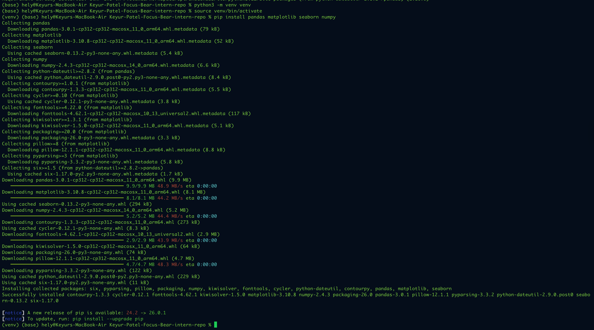
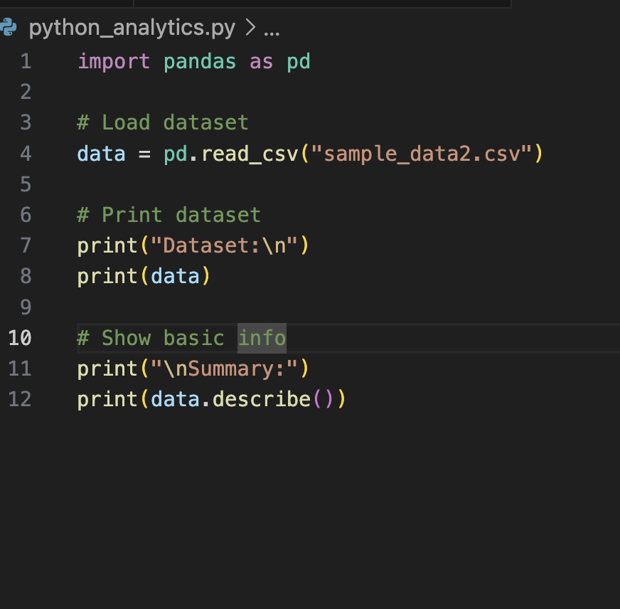
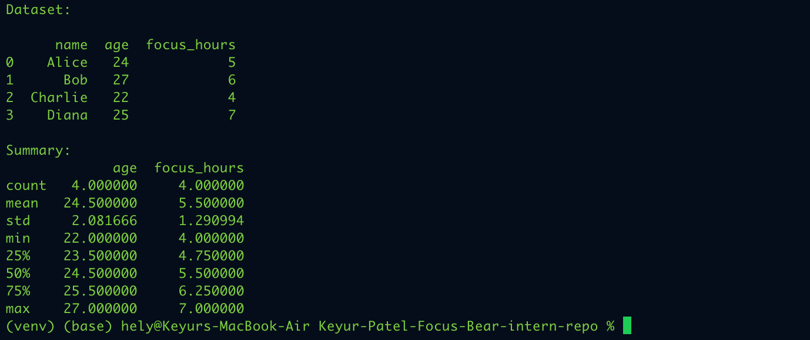

# Introduction to Python for Data Analytics

## Tasks

### Research why Python is commonly used for data analytics

Python is widely used in data analytics because it is simple, readable, and beginner-friendly. Even someone with basic programming knowledge can quickly start working with data using Python. One of the biggest reasons for its popularity is its powerful ecosystem of libraries like Pandas, NumPy, Matplotlib, and Seaborn, which make data handling and visualization much easier.

Another reason is flexibility — Python can be used for everything from basic data cleaning to advanced machine learning and AI. It also has strong community support, meaning there are many tutorials, tools, and solutions available online. Because of all these advantages, companies like Focus Bear use Python for analyzing user data, tracking behavior, and making data-driven decisions.

### Explore the key Python libraries for analytics (pandas, matplotlib, seaborn, numpy)

There are four main libraries commonly used in data analytics:

1. Pandas

Pandas is used for handling and analyzing structured data (like tables). It allows you to:

Load CSV/JSON files
Filter and clean data
Perform grouping and aggregation
Analyze datasets easily

Example use: Reading user activity data and finding average usage time.

2. NumPy

NumPy is used for numerical operations and working with arrays. It is very fast and efficient for calculations.

Example use: Performing mathematical calculations on large datasets.

3. Matplotlib

Matplotlib is used to create basic graphs and charts such as:

Line charts
Bar charts
Scatter plots

Example use: Visualizing user engagement over time.

4. Seaborn

Seaborn is built on top of Matplotlib and is used for more advanced and visually appealing charts.

Example use:

Heatmaps
Distribution plots
Correlation graphs

### Set up a virtual environment and install necessary libraries

### Write a simple Python script that loads and prints a dataset

## Reflection

### Why is Python preferred for data analytics over other languages?

Python is preferred for data analytics because it is simple to read, beginner-friendly, and has a very large number of useful libraries. It allows people to do many different tasks like loading data, cleaning it, analyzing patterns, creating visualizations, and even building machine learning models in one language. Another big reason Python is popular is that it saves time. Instead of writing everything from scratch, analysts can use libraries like Pandas, NumPy, Matplotlib, and Seaborn to work more efficiently. This makes Python a practical and powerful choice for both small and large data projects.

### What role does Pandas play in data analysis?

Pandas plays a very important role in data analysis because it helps organize and work with structured data in a table format. It makes it easy to load files such as CSV data, inspect the dataset, filter rows, select columns, clean missing values, sort records, and perform summary calculations. In simple words, Pandas is one of the main tools that helps turn raw data into something meaningful and easier to understand. It is especially useful because many real-world analytics tasks start with cleaning and exploring data before any deeper insights can be found.

### How do Matplotlib and Seaborn help with data visualization?

Matplotlib and Seaborn help by turning raw numbers into charts that are easier to read and understand. Matplotlib is great for creating basic visualizations like line charts, bar charts, and scatter plots, while Seaborn helps create more polished and advanced statistical visualizations. These tools make it easier to find trends, compare values, and explain results clearly to other people. Instead of looking at a large table of numbers, visualizations help highlight the story behind the data in a much more effective way.

### What are some use cases for data analytics in Focus Bear?

Data analytics can be very useful in Focus Bear because it can help the team understand how users interact with the product. For example, analytics can be used to track user engagement, monitor habit completion rates, measure how often certain features are used, and identify patterns in productivity over time. It can also help the team see where users may be dropping off or struggling, which can support better product decisions. In a company like Focus Bear, data analytics can turn everyday user activity into useful insights that improve the overall user experience and help the product grow.
