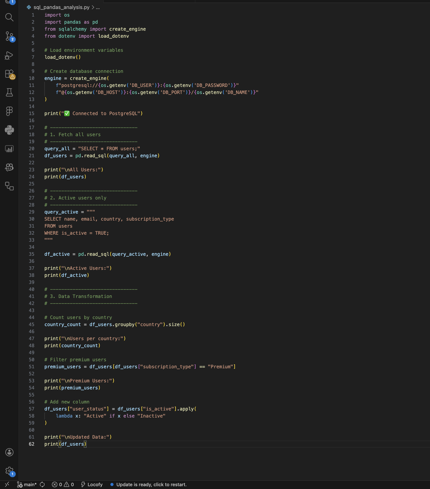
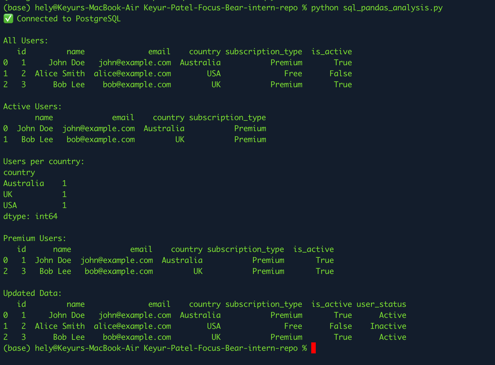

# Connecting Python & Pandas to a SQL Database

### Why is it useful to query databases directly from Python instead of using a SQL client?

Querying databases directly from Python is very useful because it allows developers to combine data extraction and data analysis in one place. Instead of manually running queries in a SQL client and then exporting the data, Python can automate the entire process. This saves time, reduces errors, and makes workflows more efficient. It also allows integration with other tools like Pandas, machine learning libraries, or dashboards, which is especially helpful in real-world projects like Focus Bear where data needs to be processed regularly.

### How does psycopg differ from psycopg2?

Psycopg and psycopg2 are both libraries used to connect Python with PostgreSQL, but psycopg is the newer and more modern version. Psycopg (version 3) is designed to be faster, more flexible, and easier to use compared to psycopg2. It supports better async operations, improved performance, and cleaner APIs. Psycopg2 is still widely used and stable, but psycopg is considered the future and is recommended for new projects.

### How can Pandas help with post-query data transformation?

Pandas plays a very important role after retrieving data from a database. Once the data is loaded into a DataFrame, Pandas makes it easy to clean, filter, and transform the data. For example, we can group data, calculate statistics, handle missing values, or create new columns. This is much easier and more flexible compared to doing everything in SQL. Pandas allows deeper analysis and helps convert raw data into meaningful insights.

### How could this integration be used to generate automated reports for Focus Bear?

This integration can be very powerful for generating automated reports in Focus Bear. Python can run scheduled scripts that query the database, process the data using Pandas, and then generate reports such as user activity trends, engagement metrics, or subscription insights. These reports can be exported as CSV files, dashboards, or even sent via email automatically. This reduces manual work and ensures that the team always has up-to-date data to make better decisions.

## Proof of task done

