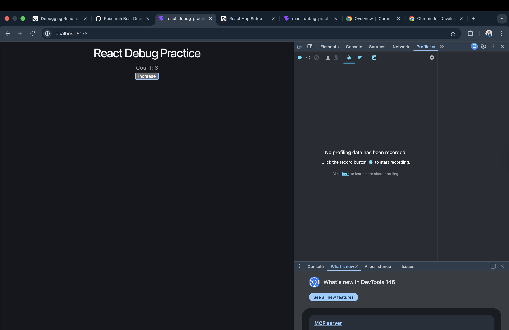
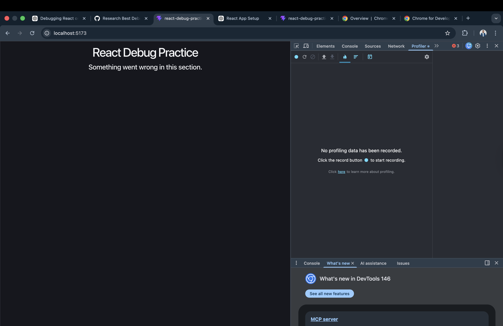
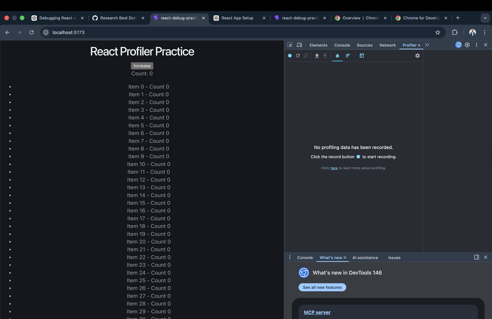

# React Debugging

## Overview

Debugging is an important part of developing React applications. Even small issues in state, props, or component logic can cause unexpected behavior. In this task, I explored different debugging techniques and tools such as the browser console, React DevTools, VS Code debugger, error boundaries, and the React Profiler.

### What are the most common debugging techniques?

The most common debugging techniques in React include using the browser console, adding `console.log()` statements, inspecting components using React DevTools, and setting breakpoints in the VS Code debugger.

The browser console is usually the first place to check because it shows errors, warnings, and logs. Using `console.log()` helps verify whether a function is running and if data is correct. Another important technique is checking props and state to ensure data is flowing correctly between components.

Breaking down the problem into smaller parts also helps. Instead of debugging the whole app, it is easier to focus on one component at a time.

### Which tools are most effective for React debugging?

### 1. Browser Console

The browser console helps identify errors quickly. It shows syntax errors, runtime errors, and warnings. It is also useful for printing values using `console.log()`.

### 2. React Developer Tools

React DevTools is one of the most powerful tools for debugging React apps. It allows me to inspect components, view props and state, and understand how components are updating. This helps identify issues related to incorrect data or unnecessary re-renders.

### 3. VS Code Debugger

The VS Code debugger allows me to set breakpoints and pause the code during execution. This makes it easier to inspect variables and understand how the program is running step by step. It is more advanced than just using console logs.

### How Do You Debug Issues in Large React Codebases?

Debugging large React codebases requires a more organized approach. In a small app, it is easy to check a few components manually, but in a large project there may be many files, shared hooks, reusable components, API utilities, and state management layers. In these situations, I would first reproduce the issue consistently so I know exactly when it happens. Then I would narrow down the problem by identifying which feature, page, or component is involved. React DevTools is very helpful here because it allows me to inspect the exact branch of the component tree where the issue occurs. After that, I would use VS Code breakpoints to trace state updates, props changes, or function calls in that part of the app.

In large codebases, it is also important to keep components small and responsibilities clear. When components are too large, debugging becomes harder because too much logic is mixed together. Reusable hooks, clean folder structure, meaningful file names, and clear state flow all make debugging easier. Error Boundaries are also very useful in large applications because they prevent a single failing section from breaking the whole interface. For performance issues in large projects, the React Profiler helps identify which components are rendering too often, while memoization tools like memo and useCallback can be used carefully to optimize problem areas.

## Error Boundaries and Performance Debugging

Error Boundaries are used in React to handle runtime errors in components. Instead of crashing the entire application, they display a fallback UI and log the error. This improves user experience and makes debugging easier because the error can be isolated to a specific component.

The React Profiler is used to analyze performance issues. It helps identify which components are rendering and how long they take. This is useful when the application feels slow. By using the profiler, I can detect unnecessary re-renders and optimize components using techniques like memoization.

## Screenshots

### React Profiler Practice

### Error Boundary Example

### Performance Test

