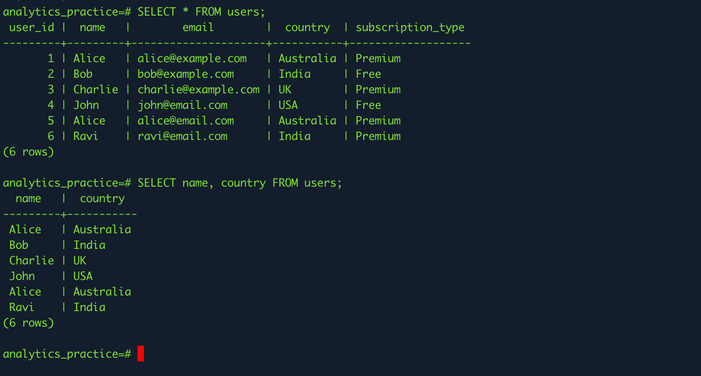
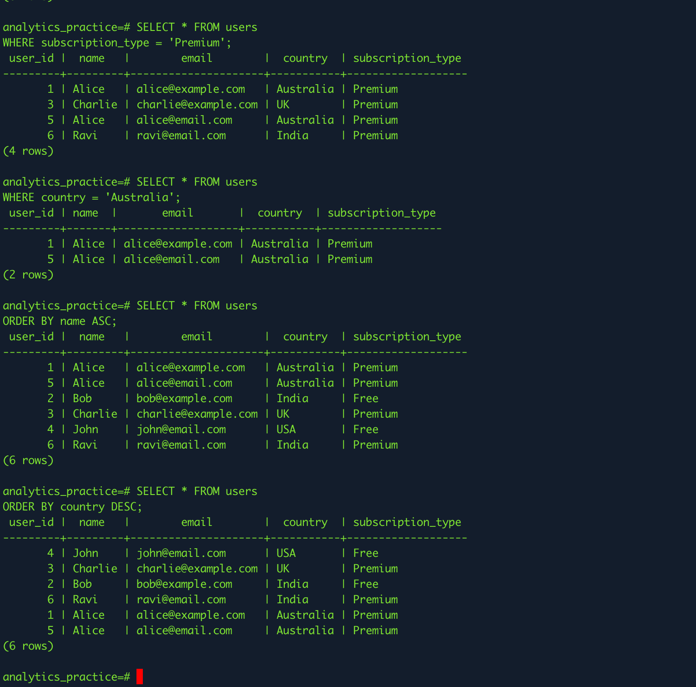
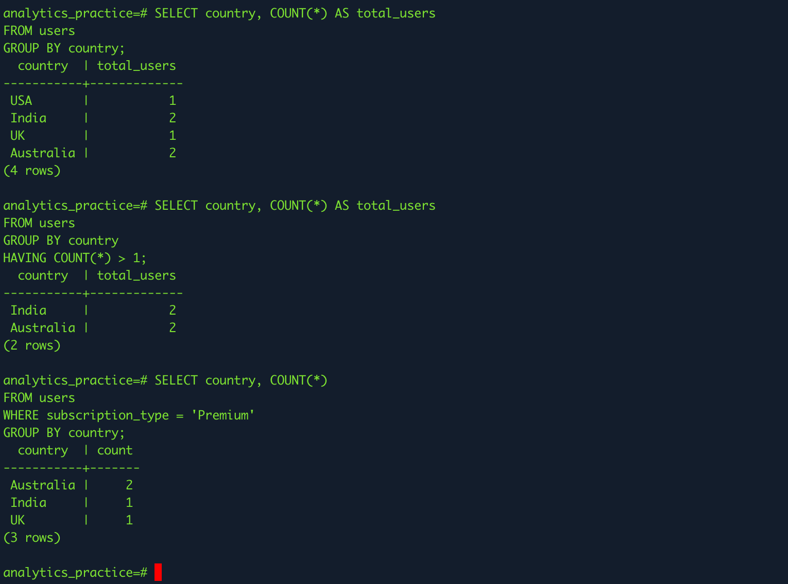

# Introduction to SQL for Data Analysis

## Tasks

### Research the basics of SQL and why it's important for analytics

SQL (Structured Query Language) is used to manage and analyze data stored in relational databases. It allows us to retrieve, filter, and manipulate data efficiently. In analytics, SQL is very important because most real-world data is stored in databases, and analysts use SQL to extract meaningful insights. It helps in querying large datasets, joining multiple tables, and preparing data for further analysis in tools like Python or Power BI.

### Write simple SELECT queries to retrieve data from a database

I practiced writing basic SQL SELECT queries to retrieve data from the database. I learned how to fetch all records as well as specific columns, which is useful for focusing only on relevant data.

### Use WHERE and ORDER BY to filter and sort data

I used the WHERE clause to filter specific records and ORDER BY to sort the results. This helped me understand how to narrow down data and organize it, which is very useful when analyzing user behavior or trends.

### Practice GROUP BY and HAVING for aggregating data

I practiced using GROUP BY and HAVING to aggregate data and generate insights such as user counts by country. This helped me understand how SQL can summarize large datasets and identify patterns, which is essential for analytics.

## Reflection

### How does SQL help in data analysis?

SQL plays a central role in data analysis because it allows us to directly interact with data stored in databases. Instead of manually going through large datasets, SQL helps us quickly retrieve only the data we need using queries. For example, we can find active users, track user behavior, or analyze trends over time.

It is especially powerful because it can handle large volumes of data efficiently. Analysts use SQL to filter, sort, join multiple tables, and prepare clean datasets before moving into deeper analysis using tools like Python, Pandas, or Power BI. In simple terms, SQL is often the first step in turning raw data into meaningful insights.

### What is the difference between filtering (WHERE) and aggregation (GROUP BY)?

Filtering and aggregation serve two different purposes in SQL.

The WHERE clause is used to filter data before any analysis happens. It helps us select only the rows that meet certain conditions. For example, we might use WHERE to get only “Premium users” or users from a specific country.

On the other hand, GROUP BY is used to combine rows and perform calculations like counts, averages, or sums. It groups similar data together so we can analyze patterns. For example, we can use GROUP BY to count how many users are in each country.

In short:

WHERE → filters data
GROUP BY → summarizes data

### How would you retrieve and analyze user activity data in Focus Bear’s database?

To analyze user activity in Focus Bear, I would first use SQL to retrieve relevant data from tables such as users, sessions, or activity logs. For example, I could write queries to find how often users log in, how long their sessions last, or which features they use most.

After retrieving the data, I would use filtering (WHERE) to focus on specific groups, such as active users or users with premium subscriptions. Then, I would use aggregation (GROUP BY) to identify patterns, like daily active users, average session duration, or activity trends by country.

Once the data is structured and cleaned using SQL, I would load it into Python (using Pandas) or a tool like Power BI to create visualizations and deeper insights. This combination helps in understanding user behavior and improving product decisions.

### Why is learning SQL important even if you primarily use Python for analytics?

Even if Python is used for advanced analysis, SQL is still very important because most real-world data is stored in databases. Before using Python, you first need to extract the right data, and that is where SQL comes in.

SQL is faster and more efficient for querying large datasets compared to loading everything into Python. It allows you to filter and prepare data at the source, which reduces processing time and improves performance.

In practice, SQL and Python are used together. SQL handles data extraction and basic transformations, while Python is used for deeper analysis, machine learning, and visualization. Learning SQL makes you a more complete data analyst because you can work with data more efficiently from start to finish.
