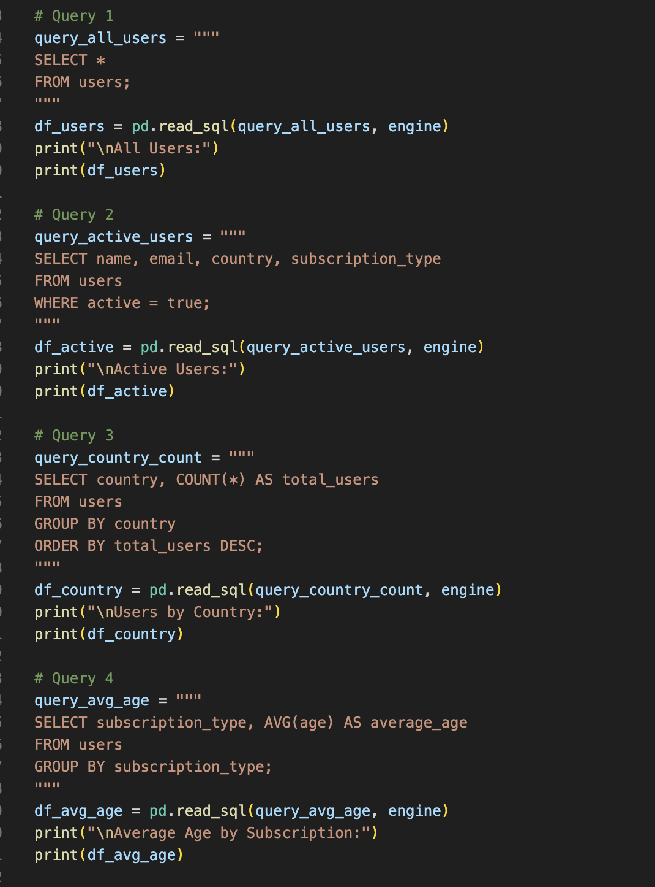
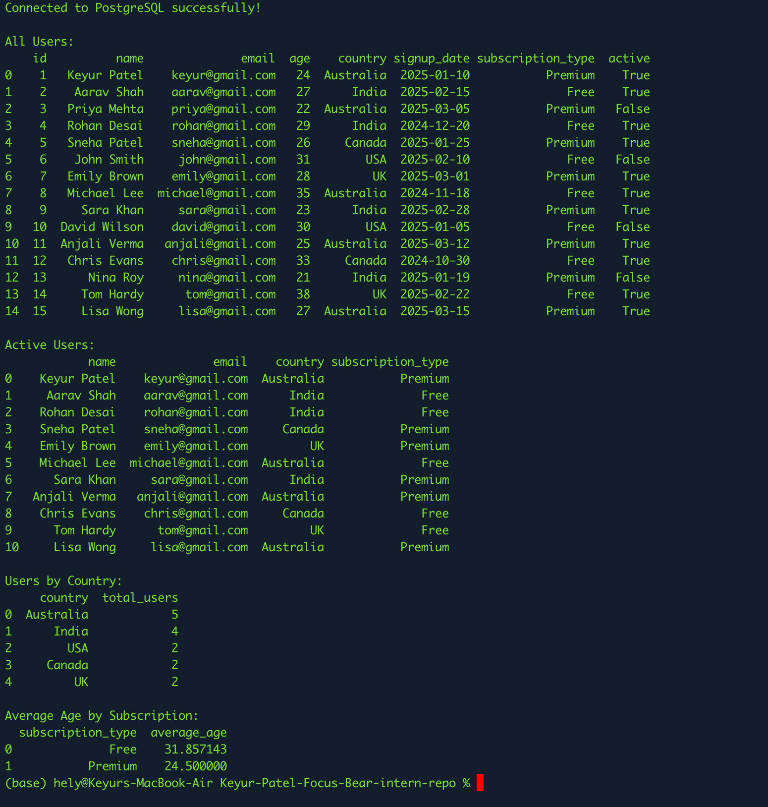
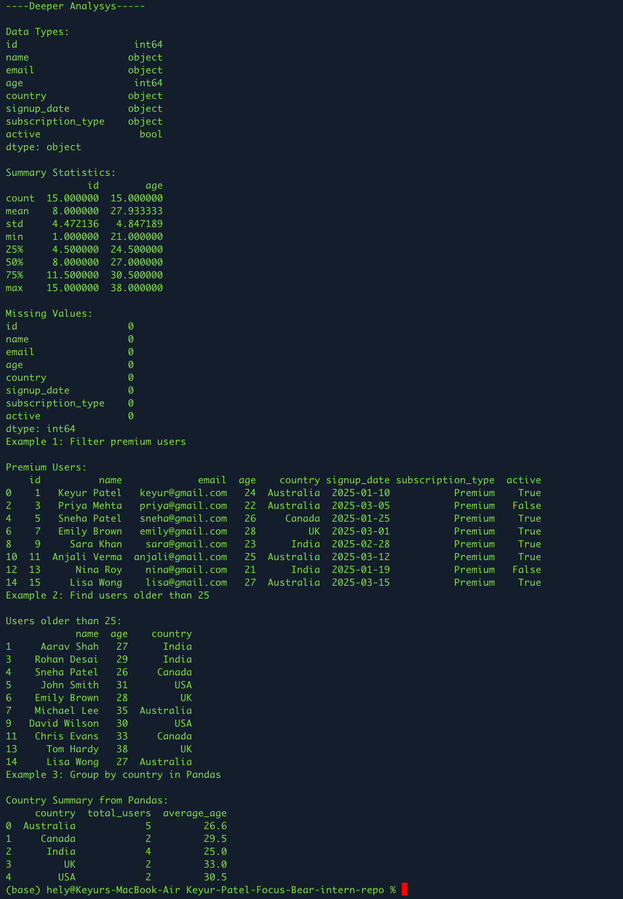

#

## Tasks Proof

## Reflection

### How can combining SQL and Pandas improve data analysis and reporting for Focus Bear?

Combining SQL and Pandas makes data analysis much more efficient and meaningful for Focus Bear.

SQL is mainly used to pull the right data from the database. For example, we can quickly filter active users, get premium subscribers, or group users by country without loading unnecessary data. This makes the process faster and more efficient, especially when dealing with large datasets.

Once the data is fetched, Pandas is used to perform deeper analysis. It helps in cleaning the data, handling missing values, and transforming it into a useful format. With Pandas, we can easily analyze user behavior, identify trends, calculate averages, and group data to generate insights. It also allows us to create new features like monthly activity or user segments.

Together, SQL and Pandas create a powerful workflow. SQL handles data extraction, while Pandas handles analysis and transformation. This combination helps Focus Bear better understand user engagement, track patterns, and make data-driven decisions to improve the product.
